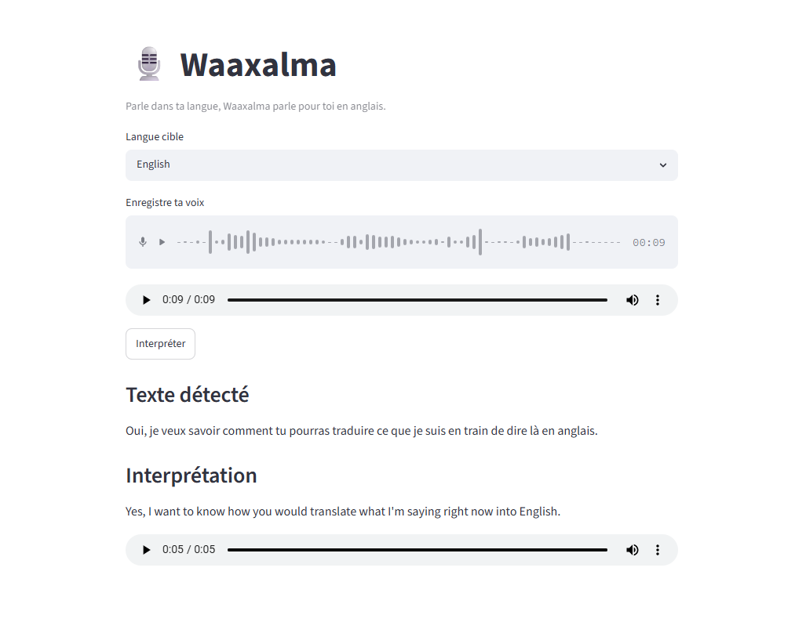

# Waaxalma

> **Speak for me.**

Waaxalma is an open-source AI Voice Agent Framework designed to enable natural multilingual communication through intelligent and composable voice agents.

Its mission is to help people communicate seamlessly across languages by combining speech recognition, translation, conversational intelligence, and speech synthesis within a modular, observable, and extensible framework.

---

## ✨ Features

- 🎙️ Speech-to-Text
- 🌍 Multilingual translation
- 🔊 Text-to-Speech
- 🤖 Multi-agent architecture
- 🧩 Skills-based design
- 🔌 Provider abstraction
- 💬 Session-aware execution
- 🔄 Unified agent orchestration
- 🛡️ Audio input validation
- ⏱️ Provider timeouts
- 🔁 Selective retries with exponential backoff
- 🔍 Execution tracing
- 📊 Prometheus metrics
- 🚀 FastAPI backend
- 🖥️ Streamlit client
- ✅ Automated resilience tests

---

## 🏗️ Architecture

```text
Clients
(Streamlit / REST API)

        │
        ▼

API Layer
(FastAPI routes, validation, error handlers)

        │
        ▼

Agent Orchestrator
(Unified execution entry point)

        │
        ├── SessionContext
        ├── ExecutionTrace
        └── AgentResult

        │
        ▼

Agent Layer
(InterpreterAgent, TranslationAgent)

        │
        ▼

Skills Layer
(STT, Translation, TTS)

        │
        ▼

Resilience Layer
(Timeouts, retries, backoff, error normalization)

        │
        ▼

Provider Layer
(OpenAI today, more providers planned)

        │
        ▼

Observability
(Logs, traces, stage latency, Prometheus metrics)
```

### Execution flow

For an audio interpretation request, the current pipeline is:

```text
Audio input
    │
    ▼
Audio validation
    │
    ▼
Speech-to-Text
    │
    ▼
Translation
    │
    ▼
Text-to-Speech
    │
    ▼
Generated audio response
```

Each stage is traced independently and associated with a session and a unique trace identifier.

---

## 🛡️ Reliability

Waaxalma v0.3.0 introduces a reliability layer around agent and provider execution.

### Audio validation

Uploaded audio is validated before entering the agent pipeline:

- File extension and MIME type
- Empty file detection
- Maximum file size
- Maximum audio duration
- Corrupted or undecodable audio
- Temporary file cleanup

### Provider resilience

Provider calls support:

- Asynchronous execution
- Explicit operation-specific timeouts
- Selective retries for transient failures
- Exponential backoff
- Configurable jitter
- Immediate failure for non-retryable errors
- Normalized provider exceptions
- Cancellation propagation

OpenAI SDK retries are disabled so that retry behavior remains centralized and predictable within Waaxalma.

### Error normalization

Pipeline and provider errors are returned through a consistent API contract:

```json
{
  "detail": {
    "code": "PROVIDER_UNAVAILABLE",
    "message": "The provider is currently unavailable.",
    "details": {
      "provider": "openai",
      "operation": "speak",
      "retryable": true
    }
  }
}
```

Typical error codes include:

- `EMPTY_AUDIO`
- `CORRUPTED_AUDIO`
- `PROVIDER_TIMEOUT`
- `PROVIDER_UNAVAILABLE`
- `PROVIDER_RATE_LIMITED`
- `PROVIDER_REQUEST_FAILED`
- `PROVIDER_AUTHENTICATION_FAILED`
- `AGENT_TIMEOUT`
- `AGENT_EXECUTION_FAILED`

---

## 🔍 Observability

Every agent execution is correlated using:

- `session_id`
- `trace_id`
- Agent name
- Operation name

The pipeline records:

- Total agent execution duration
- Per-stage duration
- Stage success or failure
- Provider retry count
- Error code and failure stage

Prometheus metrics are exposed through:

```text
GET /metrics
```

Available metrics include:

```text
waaxalma_agent_executions_total
waaxalma_agent_duration_seconds
waaxalma_stage_executions_total
waaxalma_stage_duration_seconds
waaxalma_provider_retries_total
```

---

## 🚀 Current Status

### v0.3.0 — Reliability

The reliability milestone is complete.

Implemented and validated:

- Unified execution through `AgentOrchestrator`
- Session-aware execution through `SessionContext`
- Audio validation
- Centralized API error handling
- Asynchronous providers and skills
- Timeouts and selective retries
- Provider error normalization
- Pipeline tracing
- Per-stage latency metrics
- Prometheus metrics endpoint
- Automated resilience and partial-failure tests

The current automated test suite covers:

- Successful execution
- Provider timeout
- Retry followed by success
- Retry exhaustion
- Provider unavailability
- Non-retryable provider errors
- Successful audio pipeline execution
- Partial pipeline failure
- HTTP error mapping

```text
13 tests passed
```

---

## 🚀 Running the Project

### Backend

From the repository root:

```powershell
.\backend\.venv\Scripts\Activate.ps1

python -m uvicorn app.main:app `
  --reload `
  --app-dir backend
```

The API is available at:

```text
http://127.0.0.1:8000
```

API documentation:

```text
http://127.0.0.1:8000/docs
```

Prometheus metrics:

```text
http://127.0.0.1:8000/metrics
```

### Streamlit client

From the repository root:

```powershell
.\backend\.venv\Scripts\Activate.ps1

python -m streamlit run streamlit/streamlit_app.py
```

---

## ✅ Running the Tests

From the `backend` directory:

```powershell
python -m pytest -q
```

Run the reliability tests only:

```powershell
python -m pytest tests/resilience -v
```

Run the interpreter pipeline tests:

```powershell
python -m pytest tests/agents/test_interpreter_pipeline.py -v
```

---

## ⚙️ Reliability Configuration

Provider resilience can be configured through environment variables:

```dotenv
STT_TIMEOUT_SECONDS=30
TRANSLATION_TIMEOUT_SECONDS=20
TTS_TIMEOUT_SECONDS=30

PROVIDER_MAX_ATTEMPTS=3
PROVIDER_INITIAL_BACKOFF_SECONDS=0.5
PROVIDER_BACKOFF_MULTIPLIER=2.0
PROVIDER_MAX_BACKOFF_SECONDS=4.0
PROVIDER_JITTER_RATIO=0.2
```

Secrets such as provider API keys must be stored in a local `.env` file and must not be committed to Git.

---

## 📚 Documentation

Project documentation is available in the `docs/` directory.

It includes:

- Architecture & Vision Book
- Technical roadmap
- Version-aligned milestones
- Future Architecture Decision Records
- Agent and provider design documentation

---

## 🗺️ Roadmap

| Repository Version | Milestone | Focus |
|---|---|---|
| **v0.1.0** | Prototype | Voice → Translation → Speech proof of concept |
| **v0.2.0** | Agent Orchestration | Unified execution pipeline, `AgentOrchestrator`, `SessionContext`, agent contracts |
| **v0.3.0** | Reliability | Validation, async execution, retries, timeouts, tracing, metrics, resilience tests |
| **v0.4.0** | Provider Abstraction & Extensibility | Specialized agents, interchangeable providers, configurable pipelines |
| **v0.5.0** | Product Readiness | Persistent sessions, security, packaging, CI/CD, production observability |
| **v1.0.0** | Stable Framework | Production-ready open-source voice agent framework |

---

## 🖥️ Interface

### v0.1.0 — Streamlit prototype



---

## 🤝 Contributing

Waaxalma is under active development.

Contributions related to agents, providers, multilingual support, testing, observability, documentation, and developer experience are welcome.

Before submitting a change:

```powershell
python -m pytest -q
```

Please ensure that new provider or pipeline behavior includes appropriate automated tests.

---

## 📄 License

Licensed under the Apache License 2.0.