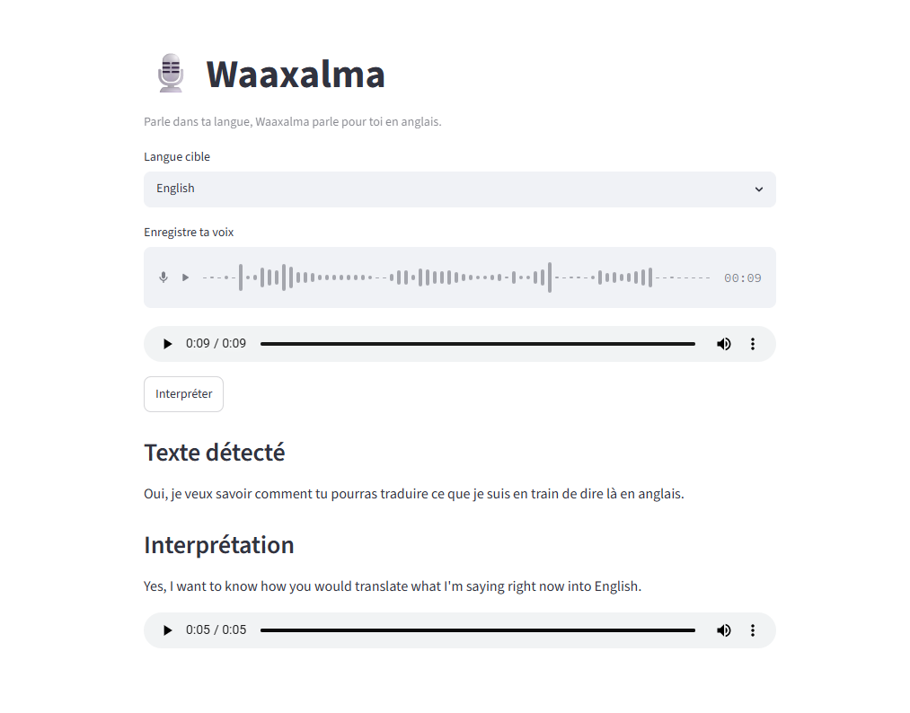

# Waaxalma

> **Speak for me.**

Waaxalma is an open-source **AI Voice Agent Framework** for natural
multilingual communication through intelligent, composable, observable,
and provider-independent voice agents.

Its mission is to help people communicate across languages by combining
speech recognition, translation, contextual processing, quality
evaluation, and speech synthesis within a modular framework.

------------------------------------------------------------------------

## Stable Framework Release --- v1.1.1

The six readiness slices add persistent SQLite sessions with immutable
client owners, strict X-Client-Id boundaries, typed configuration,
wheel/container packaging, Windows/Linux quality gates, business
observability, retention and release governance. X-Client-Id remains
self-declared identity, not authentication. The v1.0.0 framework adds
stable public imports, extension conformance, reviewed HTTP/WebSocket
contracts and runtime/upgrade guarantees. The final tag follows the
[release checklist](docs/release-v1.0.0.md).

Start the portable backend/UI stack with `docker compose up --build -d`
after configuring your root `.env`. Health: `/health/live` and
`/health/ready`; metrics: `/metrics`; UI: `http://localhost:8501`.
Containers run non-root; the data volume survives ordinary stop/down.
Backend and UI use separate dependency environments.

Read [security boundaries](SECURITY.md), [operations and
retention](docs/operations.md), [observability](docs/observability.md),
[environment variables](ENVIRONMENT.md) and the [Architecture & Vision
Book v1.1.0](docs/Architecture_Vision_Book_v1.1.0.md). Automatic
closed-session cleanup is disabled by default; its eligibility policy is
30 days. Active sessions are never automatically deleted by this
release.

Stable extension authors use `app.framework` and optional
`app.framework.testing`. Read the [public
contracts](docs/framework-contracts.md), [conformance
guide](docs/extension-conformance.md), [API
contracts](docs/api-streaming-stability.md), [supported
runtime](docs/supported-runtime.md) and [upgrade
guide](docs/upgrade-v0.5-to-v1.md). The English Word book is in
`docs/book/Waaxalma_Architecture_Vision_Book_v1.1.0_EN.docx`.

## Conference audio isolation and monitoring — v1.1.1

Waaxalma supports an independent **Conference Monitor** in Audio devices, alongside the existing translated-audio Local Monitor. For the validated two-cable Windows/Teams setup:

| Component | Device |
| --- | --- |
| Teams Speaker | CABLE-A Input |
| Waaxalma Conference Input | CABLE-A Output |
| Waaxalma Conference Monitor | Enabled; output = physical headphones/headset |
| Waaxalma microphone | Physical microphone |
| Waaxalma Conference Output | CABLE-B Input |
| Teams Microphone | CABLE-B Output |

Disable Windows **Listen to this device** on CABLE-A Output when the Waaxalma Conference Monitor is enabled to prevent duplicate playback. The Conference Monitor is separate from the translated-audio Local Monitor and Full Duplex Start/Stop. The reference-aware `ConferenceAudioIsolation` layer is used by Direct and Enhanced. **Reference-VAD gating is not acoustic echo cancellation** and can attenuate local speech during simultaneous remote/local speech; test double-talk before deploying more broadly. Without a valid reference, isolation cannot suppress remote audio leaking into the physical microphone. See [conference audio operations](docs/conference-audio-v1.1.1.md).

## 📊 Prometheus + Grafana observability --- v1.0.2

Waaxalma v1.0.2 adds a provisioned Prometheus + Grafana metrics stack to
the Docker Compose environment.

-   Prometheus scrapes the backend `/metrics` endpoint.
-   Grafana provisions the Prometheus datasource and **Waaxalma ---
    Overview** dashboard automatically.
-   The dashboard covers HTTP traffic/latency, active sessions, provider
    calls/errors/retries, pipeline and agent execution, realtime
    activity, token usage and estimated provider cost.
-   Filters: **Provider**, **Operation**, **Route**.
-   Estimated cost is produced only when provider token pricing is
    configured.
-   OpenTelemetry remains optional and independent.
-   Observability stack tests run without Docker.

  Component      Local endpoint
  -------------- ------------------
  Waaxalma UI    `localhost:8501`
  Waaxalma API   `localhost:8000`
  Prometheus     `localhost:9090`
  Grafana        `localhost:3000`

## 📝 Text Translation workspace --- v1.1.0

Waaxalma v1.1.0 adds a dedicated **Text** workspace alongside the existing
**Voice** workspace. Text translation reuses the framework's Context,
Translation and Quality capabilities without invoking speech synthesis.

```text
Streamlit Text Workspace
        ↓
POST /api/text/translate
        ↓
TextTranslationService
        ↓
Context → Translation → Quality
        ↓
Translated Text
```

-   Workspace selection is explicit: **Voice** or **Text**.
-   Voice keeps the existing **Standard**, **Direct** and **Enhanced** modes.
-   Text accepts source text, an optional source language and a target language.
-   `POST /api/text/translate` preserves the existing `X-Client-Id` security
    boundary and request correlation.
-   The service is composed from existing Skills, stages and provider
    abstractions rather than adding provider-specific logic to the API layer.
-   Provider calls, latency, failures, token usage and estimated cost continue
    through the existing observability model.
-   Document upload, batch translation, persistent translation history and
    custom glossaries are outside the v1.1.0 scope.

------------------------------------------------------------------------

## Previous product milestone --- v0.4.4

Waaxalma v0.4.4 adds **Conferencing Audio & Device Control** on top of
the Universal Audio Output bridge introduced in v0.4.3.

The release focuses on the primary product path:

``` text
Physical microphone
        ↓
Explicit Audio Input
        ↓
Standard / Direct / Enhanced
        ↓
Translated audio
        ├── Primary / Conference Output → Virtual Audio Cable → Teams / Meet / Zoom
        └── Local Monitor               → Headphones
```

v0.4.4 removes the dependency on the Windows default microphone, adds an
independent local-monitor path, improves the Streamlit audio workspace,
and keeps conferencing integration application-agnostic by treating
browser audio devices as the integration boundary.

Inbound conference capture, inbound translation, and Full Duplex
coordination are included as **experimental capabilities**. They are not
release-blocking for v0.4.4 because the primary milestone is reliable
outbound **Waaxalma → conferencing application** audio delivery.

The architectural principle remains unchanged:

> **Add an agent, provider, pipeline, realtime capability, or
> audio-device integration without changing the API or orchestration
> core.**

------------------------------------------------------------------------

## ✨ Features

-   🎙️ Speech-to-Text
-   🌍 Multilingual translation
-   📝 Dedicated text translation workspace
-   🔗 `POST /api/text/translate` text translation API
-   🔊 Text-to-Speech
-   🤖 Multi-agent architecture
-   🧩 Skills-based design
-   🔌 Provider abstraction and interchangeability
-   🗂️ Agent, provider, and pipeline registries
-   🔀 Configurable text and audio pipelines
-   🧠 Context capability
-   ✅ Quality evaluation capability
-   💬 Session-aware execution
-   🔄 Unified agent orchestration
-   🌐 Generic agent execution API
-   ⚡ Realtime Direct translation over WebRTC
-   🎛️ Realtime Enhanced streaming mode
-   📝 Live source transcript
-   🧭 Explicit source-language selection
-   📚 Terminology / keyword hints
-   🧠 Rolling realtime source context
-   🔄 Streaming translation
-   🗣️ Streaming TTS
-   🎚️ Configurable realtime voice
-   🔉 PCM16 continuity handling
-   📦 20 ms client playback jitter buffer
-   🎤 Local VAD-based utterance commit
-   🛡️ Audio input validation
-   ⏱️ Provider timeouts
-   🔁 Selective retries with exponential backoff
-   🔍 Execution tracing
-   📊 Prometheus metrics
-   📈 Realtime latency measurements
-   🚀 FastAPI backend
-   🖥️ Streamlit client
-   🔊 Universal browser audio-output selection
-   🎤 Explicit realtime input-device selection
-   🎧 Independent local-monitor output
-   🎛️ Consolidated Streamlit audio-device workspace
-   🔁 Conferencing-aware device persistence
-   🎙️ Experimental conference-input capture
-   🌐 Experimental inbound conference translation
-   🔄 Experimental Full Duplex session coordination
-   🎧 Output-device discovery and refresh
-   🎛️ `HTMLMediaElement.setSinkId()` routing
-   🔌 Shared `AudioOutputManager`
-   🧵 Standard / Direct / Enhanced output convergence
-   🎚️ Virtual audio cable routing for conferencing
-   💻 Microsoft Teams conferencing bridge validated with Microsoft Edge
-   🖼️ Streamlit embedded clients migrated to `st.iframe`
-   ✅ Automated resilience, composition, realtime, and regression tests

------------------------------------------------------------------------

## 🏗️ Framework Architecture

The standard framework path remains registry- and contract-driven:

``` text
Clients
(Streamlit / REST API)
        │
        ▼
Generic API
(FastAPI routes, validation, error handlers)
        │
        ▼
AgentOrchestrator
        │
        ▼
AgentRegistry
        │
        ▼
Agents
        │
        ▼
PipelineRegistry
        │
        ▼
Configurable Pipelines
        │
        ▼
Pipeline Stages
(Context / STT / Translation / Quality / Speech)
        │
        ▼
Skills
        │
        ▼
Provider Contracts
        │
        ▼
ProviderRegistry
        │
        ▼
Concrete Providers
(OpenAI / passthrough / deterministic / future providers)
```

`SessionContext`, execution tracing, error normalization, resilience
controls, and metrics are cross-cutting concerns shared across the
standard execution path.

Realtime sessions are intentionally kept outside `AgentOrchestrator` and
`SequentialPipeline` because they are long-lived, streaming, and
transport-aware.

------------------------------------------------------------------------

## 🤖 Agent Extensibility

Agents are registered through `AgentRegistry` and executed through
`AgentOrchestrator`.

The generic endpoint:

``` text
POST /api/agents/{agent_name}/execute
```

contains no agent-specific routing logic.

Adding a registered agent does not require a new FastAPI route or a
change to the orchestration core.

------------------------------------------------------------------------

## 🔌 Provider Extensibility

Providers are resolved through `ProviderRegistry` by:

``` text
capability + provider name
```

Default v0.4.4 provider mapping:

``` text
translation               / openai
speech                    / openai
speech_to_text            / openai
context                   / passthrough
quality                   / deterministic

realtime_translation      / openai

streaming_transcription   / openai
streaming_translation     / openai
streaming_speech          / openai
```

This allows provider implementations to be replaced without modifying
the API, agent, pipeline orchestration, or provider-independent service
contracts.

------------------------------------------------------------------------

## 🔀 Standard Interpreter Pipelines

Interpreter workflows are composed with `SequentialPipeline` and
registered through `PipelineRegistry`.

### Text translation service --- v1.1.0

```text
Context
  → Translation
  → Quality
```

`TextTranslationService` owns this speech-free execution path. It is composed
at bootstrap from the existing Context, Translation and Quality Skills and
providers, and is exposed through `POST /api/text/translate`.

### Text interpretation

``` text
Context
  → Translation
  → Quality
  → Speech
```

### Audio interpretation

``` text
Transcription
  → Context
  → Translation
  → Quality
  → Speech
```

Pipeline order is explicit and testable.

New stages can be introduced without embedding orchestration logic
inside `InterpreterAgent`.

------------------------------------------------------------------------

## 🧠 Context and Quality

Context and Quality remain first-class capabilities for standard
interpreter pipelines.

The default configuration adds **no additional LLM call**:

``` dotenv
CONTEXT_PROVIDER=passthrough
QUALITY_PROVIDER=deterministic
```

`PassthroughContextProvider` preserves the source text while keeping
contextual enrichment as a replaceable capability.

`DeterministicQualityProvider` performs structural checks without
claiming semantic translation evaluation.

Example quality result:

``` json
{
  "quality": {
    "accepted": true,
    "score": null,
    "issues": [],
    "metadata": {
      "evaluation": "deterministic",
      "semantic_evaluation": false,
      "target_language": "English"
    }
  }
}
```

Realtime modes use different context strategies:

``` text
Standard
  ContextStage + QualityStage

Realtime Direct
  bypasses standard Context / Quality
  to minimize provider-native latency

Realtime Enhanced
  terminology + rolling source context
  applied inside the streaming runtime
```

Enhanced does not add a semantic quality-evaluation LLM call in v0.4.2.

------------------------------------------------------------------------

# ⚡ Realtime Translation

Waaxalma exposes two explicit realtime modes.

------------------------------------------------------------------------

## Realtime Direct --- v0.4.1+

Realtime Direct is the provider-native low-latency path.

``` text
Microphone
    ↓
Realtime Session API
    ↓
RealtimeTranslationService
    ↓
ProviderRegistry
    ↓
RealtimeTranslationProvider
    ↓
Provider WebRTC session
    ↓
Translated transcript
    +
Translated audio
```

Primary backend endpoint:

``` text
POST /api/realtime/translation/session
```

The backend creates a short-lived provider session and returns an
ephemeral client secret.

The browser then negotiates WebRTC directly with the realtime provider.

Realtime Direct deliberately bypasses the standard Context and Quality
stages.

------------------------------------------------------------------------

## Realtime Enhanced --- v0.4.2+

Realtime Enhanced decomposes realtime interpretation into explicit
streaming capabilities.

``` text
Microphone
    ↓
WebRTC Streaming STT
    ↓
Partial transcript ─────────────► Live source UI
    ↓
Authoritative final STT transcript
    ↓
RealtimeEnhancedProcessor
    ↓
Terminology + rolling source context
    ↓
StreamingTranslationProvider
    ↓
Translated text deltas ─────────► Live translation UI
    ↓
SpeakableTextBuffer
    ↓
StreamingSpeechProvider
    ↓
PCM16 streaming audio
    ↓
20 ms jitter buffer
    ↓
Translated audio
```

Backend interfaces:

``` text
POST /api/realtime/enhanced/session
WS   /api/realtime/enhanced/stream
```

### Enhanced session responsibilities

The session runtime keeps:

-   target language;
-   optional source language;
-   terminology;
-   session identifier;
-   pending transcript state;
-   three previous committed source segments as rolling context.

### Final transcript authority

Partial transcription events are useful for live UI feedback, but they
are not treated as the translation source of truth.

``` text
partial STT deltas
        ↓
live source UI

final STT transcript
        ↓
authoritative committed source text
        ↓
translation
```

This avoids translating an imperfect reconstruction of incremental
deltas.

### Rolling context

The previous three final source segments are retained as
**reference-only context**.

They help disambiguate short utterances but are not translated again.

### Terminology

Enhanced supports explicit terminology / keyword hints for names,
product terms, and domain vocabulary.

Example:

``` text
Waaxalma, Enhanced, Direct, transcript, terminology
```

Terminology is used to improve both recognition and translation
consistency.

### Streaming speech

Translated text is passed incrementally to `SpeakableTextBuffer`.

Speakable segments are sent to TTS as soon as they are ready, allowing
translation and speech generation to overlap.

### Audio playback hardening

Enhanced playback includes:

-   PCM16 byte continuity across provider chunks;
-   carry-byte handling for odd-sized network chunks;
-   24 kHz PCM playback;
-   ordered Web Audio scheduling;
-   minimum 20 ms playback jitter buffering.

------------------------------------------------------------------------

## 🎛️ Conferencing Audio & Device Control --- v0.4.4

v0.4.4 extends the v0.4.3 `AudioOutputManager` with explicit realtime
input selection and a separate local-monitor destination.

### Primary conferencing path

``` text
Physical microphone
    ↓
AudioInputManager
    ↓
Direct / Enhanced
    ↓
translated audio
    ↓
AudioOutputManager
    ↓
Primary / Conference Output
    ↓
Virtual Audio Cable
    ↓
Teams / Meet / Zoom microphone
```

The physical microphone is selected explicitly through
`waaxalma.audioInputDeviceId`. Direct and Enhanced therefore no longer
depend on whichever input Windows exposes as the global default.

### Independent local monitoring

Translated audio can be monitored locally without using Windows **Listen
to this device**:

``` text
translated audio
    ├── Primary / Conference Output → virtual cable
    └── Local Monitor               → headphones
```

The monitor path uses:

``` text
waaxalma.monitorOutputDeviceId
waaxalma.monitorEnabled
```

Direct duplicates the translated WebRTC `MediaStream` to independently
managed conference and monitor audio elements. Enhanced keeps its
existing PCM scheduler and `MediaStreamAudioDestinationNode`, then
exposes that stream to independent output sinks. Standard mirrors
generated audio through the same device-control model.

### Streamlit audio workspace

The browser device controls are grouped under one **Audio Devices &
Conferencing** workspace with dedicated tabs for:

``` text
Microphone
Conference Output
Local Monitor
Conference Input
```

The application uses Streamlit wide layout and `st.iframe`, reducing
vertical scrolling while keeping device routing separate from
interpretation controls.

### Conferencing bridge

The validated outbound integration remains application-agnostic:

``` text
Waaxalma
    → virtual audio playback endpoint
    → virtual audio recording endpoint
    → conferencing application microphone
```

Microsoft Edge remains the validated reference browser for the real
Teams bridge. Chrome exposed and selected the virtual output after site
audio-device permission was granted, but the remote Teams participant
did not receive audio in the tested v0.4.3 setup.

### Experimental inbound / Full Duplex path

v0.4.4 also contains experimental building blocks for:

``` text
Conference Input
    → streaming STT
    → translation
    → TTS
    → Local Monitor
```

plus Full Duplex Start / Stop coordination between outbound and inbound
clients.

These features require a second independent virtual audio path for
proper end-to-end validation and are **not part of the blocking v0.4.4
release acceptance criteria**.

The release acceptance path remains:

``` text
Waaxalma
    → virtual audio cable
    → Teams / Meet / Zoom
```

## 🎤 Turn Detection

Enhanced currently uses a lightweight browser-side RMS voice activity
detector.

The configured silence window is approximately:

``` text
16 frames × 20 ms ≈ 320 ms
```

This is a latency / segmentation compromise, not a semantic endpoint
detector.

The VAD triggers the transcription audio commit for each utterance.

------------------------------------------------------------------------

## 🎚️ Realtime Voice Configuration

Enhanced uses configurable streaming speech settings.

Example:

``` dotenv
STREAMING_SPEECH_PROVIDER=openai
STREAMING_SPEECH_MODEL=gpt-4o-mini-tts
STREAMING_SPEECH_VOICE=coral
```

Realtime Direct keeps provider-specific realtime voice behavior.

------------------------------------------------------------------------

## 🛡️ Reliability

Waaxalma v0.3.0 introduced the reliability layer that remains part of
the v0.4.x framework foundation.

### Audio validation

Uploaded audio is validated before entering the standard agent pipeline:

-   file extension and MIME type;
-   empty file detection;
-   maximum file size;
-   maximum audio duration;
-   corrupted or undecodable audio;
-   temporary file cleanup.

### Provider resilience

Provider calls support, where appropriate:

-   asynchronous execution;
-   explicit operation-specific timeouts;
-   selective retries for transient failures;
-   exponential backoff;
-   configurable jitter;
-   immediate failure for non-retryable errors;
-   normalized provider exceptions;
-   cancellation propagation.

OpenAI SDK retries are disabled for standard provider calls so retry
behavior remains centralized and predictable within Waaxalma.

### Realtime hardening

Realtime behavior additionally includes:

-   ephemeral provider credentials;
-   normalized session-creation failures;
-   controlled Direct reconnect behavior;
-   WebSocket disconnect handling;
-   clean Stop / resource teardown, including managed audio-output
    elements;
-   browser logging quiet by default;
-   detailed internal timing available at debug level.

------------------------------------------------------------------------

## ⚠️ Error Normalization

Pipeline and provider errors use a consistent API contract.

Example:

``` json
{
  "detail": {
    "code": "PROVIDER_UNAVAILABLE",
    "message": "The provider is currently unavailable.",
    "details": {
      "provider": "openai",
      "operation": "speak",
      "retryable": true
    }
  }
}
```

Typical error codes include:

-   `EMPTY_AUDIO`
-   `CORRUPTED_AUDIO`
-   `PROVIDER_TIMEOUT`
-   `PROVIDER_UNAVAILABLE`
-   `PROVIDER_RATE_LIMITED`
-   `PROVIDER_REQUEST_FAILED`
-   `PROVIDER_AUTHENTICATION_FAILED`
-   `AGENT_TIMEOUT`
-   `AGENT_EXECUTION_FAILED`

------------------------------------------------------------------------

## 🔍 Observability

Prometheus metrics are exposed through:

``` text
GET /metrics
```

Standard execution metrics include:

``` text
waaxalma_agent_executions_total
waaxalma_agent_duration_seconds
waaxalma_stage_executions_total
waaxalma_stage_duration_seconds
waaxalma_provider_retries_total
```

Realtime metrics include:

``` text
waaxalma_realtime_sessions_total
waaxalma_realtime_session_creation_duration_seconds
waaxalma_realtime_session_errors_total
waaxalma_realtime_client_latency_seconds
```

Enhanced additionally records processor-level latency checkpoints such
as:

``` text
commit → first translation
commit → first speakable text
commit → TTS start
commit → first audio
TTS start → first audio
translation → first audio
```

Browser Enhanced metrics are tracked per utterance.

------------------------------------------------------------------------

## 📈 Realtime Performance Baselines

These are observed local benchmark results from the v0.4.1/v0.4.2
realtime work, not service-level guarantees. v0.4.3 did not re-baseline
provider latency.

### Realtime Direct baseline

``` text
Realtime session request            ~1.61 s
Microphone acquisition              ~0.47 s
WebRTC establishment                ~1.84 s

Speech → first translated text      ~0.39 s
Speech → first translated audio     ~1.35 s
Translation → translated audio      ~0.96 s
```

### Realtime Enhanced warm-path benchmark

Measured over a 10-segment local sample:

  Metric                              p50        p95
  ---------------------------- ---------- ----------
  Commit → first translation     \~0.55 s   \~0.75 s
  Translation → first audio      \~0.60 s   \~0.81 s
  Commit → first audio           \~1.17 s   \~1.46 s
  TTS start → first audio        \~0.51 s   \~0.69 s

Provider response latency can vary between requests.

------------------------------------------------------------------------

## 🚀 Running the Project

Use Python 3.12 and separate environments. From `backend/`:

``` powershell
python -m venv .venv
.\.venv\Scripts\Activate.ps1
python -m pip install --require-hashes -r requirements-dev.lock
python -m uvicorn app.main:app --reload
```

Development reads a local `.env`; production uses explicit environment
injection. Use the installed `waaxalma-backend` command in the packaged
runtime. From `streamlit/`, in a separate terminal/environment:

``` powershell
python -m venv .venv
.\.venv\Scripts\Activate.ps1
python -m pip install --require-hashes -r requirements.lock
python -m streamlit run streamlit_app.py
```

Alternatively run Compose from the repository root. Configure
OPENAI_API_KEY there and use the configurable CLIENT_ID. See
[operations](docs/operations.md) for startup, backup, restart and
shutdown details.

------------------------------------------------------------------------

## ⚙️ Configuration

Provider credentials should be stored in a local `.env` file and must
not be committed to Git.

### Standard provider selection

``` dotenv
TRANSLATION_PROVIDER=openai
SPEECH_PROVIDER=openai
SPEECH_TO_TEXT_PROVIDER=openai
CONTEXT_PROVIDER=passthrough
QUALITY_PROVIDER=deterministic
```

### Realtime Direct

``` dotenv
REALTIME_TRANSLATION_PROVIDER=openai
REALTIME_TRANSLATION_MODEL=gpt-realtime-translate
```

### Realtime Enhanced

``` dotenv
STREAMING_TRANSCRIPTION_PROVIDER=openai
STREAMING_TRANSCRIPTION_MODEL=gpt-live-transcribe

STREAMING_TRANSLATION_PROVIDER=openai
STREAMING_TRANSLATION_MODEL=gpt-4.1-mini

STREAMING_SPEECH_PROVIDER=openai
STREAMING_SPEECH_MODEL=gpt-4o-mini-tts
STREAMING_SPEECH_VOICE=coral
```

------------------------------------------------------------------------

## ✅ Running the Tests

From the `backend` directory:

``` powershell
python -m pytest -q
```

The v0.5.0 CI runs the complete regression suite on Linux and Windows,
with optional SDK tests in a separate gate. See [release
validation](docs/slice6-validation.md) for the delivered candidate
results and remaining acceptance checks. A non-blocking Starlette/AnyIO
deprecation warning remains.

Focused test examples:

``` powershell
python -m pytest tests/resilience -v
python -m pytest tests/pipelines -v
python -m pytest tests/bootstrap/test_provider_composition.py -v
python -m pytest tests/providers/test_openai_streaming_translation_provider.py -q
python -m pytest tests/services/test_realtime_enhanced_processor_context.py -q
```

------------------------------------------------------------------------

## Product and UI history

### v0.4.3 --- Universal Audio Output & Conferencing Bridge

Implemented and manually validated:

-   global audio-output discovery and selection;
-   shared browser-side `AudioOutputManager`;
-   persisted selected output device;
-   Standard interpreted audio routed through a managed browser audio
    element;
-   Direct WebRTC translated audio routed through the selected output;
-   Enhanced PCM playback routed through
    `MediaStreamAudioDestinationNode` and the selected output;
-   Enhanced PCM carry-byte handling retained;
-   Enhanced 20 ms jitter buffer retained;
-   output cleanup on Stop / unload;
-   virtual audio cable routing with VB-Audio Virtual Cable;
-   `CABLE Input` → `CABLE Output` transport validated;
-   Microsoft Teams microphone bridge using `CABLE Output`;
-   real Teams call validated end-to-end with Microsoft Edge;
-   Streamlit embedded HTML migrated from deprecated
    `st.components.v1.html` to `st.iframe`;
-   temporary routing diagnostics removed from the production UI.

Known limitation:

-   Chrome can require explicit site audio-device permission before all
    outputs are visible. In the tested Teams setup, Edge delivered the
    virtual-cable audio to the remote participant while Chrome did not,
    despite exposing and selecting the same output device.

No native conferencing SDK is required for this release.

------------------------------------------------------------------------

## 📚 Documentation

Project documentation is available in the `docs/` directory.

It includes:

-   Architecture & Vision Book;
-   technical roadmap;
-   version-aligned milestones;
-   Architecture Decision Records;
-   agent, pipeline, provider, and realtime design documentation.

The [v0.5.0 Architecture & Vision
Book](docs/Architecture_Vision_Book_v0.5.0.md) consolidates readiness,
security, persistence and operations alongside the standard framework,
Realtime Direct, Realtime Enhanced, universal audio output, explicit
input-device control, independent local monitoring, and the experimental
inbound/full-duplex extensions.

------------------------------------------------------------------------

## 🗺️ Roadmap

  ----------------------------------------------------------------------------
  Repository        Milestone         Focus                  Status
  Version                                                    
  ----------------- ----------------- ---------------------- -----------------
  **v0.1.0**        Prototype         Voice → Translation →  Released
                                      Speech proof of        
                                      concept                

  **v0.2.0**        Agent             Unified execution,     Released
                    Orchestration     `AgentOrchestrator`,   
                                      `SessionContext`,      
                                      agent contracts        

  **v0.3.0**        Reliability       Validation, async      Released
                                      execution, retries,    
                                      timeouts, tracing,     
                                      metrics                

  **v0.4.0**        Framework Next    Registries,            Released
                                      interchangeable        
                                      providers,             
                                      configurable           
                                      pipelines, Context &   
                                      Quality                

  **v0.4.1**        Realtime          Realtime Direct,       Released
                    Translation &     WebRTC, voice          
                    Voice             configuration,         
                    Configuration     realtime observability 

  **v0.4.2**        Realtime Enhanced Streaming STT →        Released
                    Streaming         context / terminology  
                                      → translation →        
                                      streaming TTS          

  **v0.4.3**        Universal Audio   Shared output          Released
                    Output &          selection across       
                    Conferencing      Standard / Direct /    
                    Bridge            Enhanced;              
                                      virtual-cable          
                                      conferencing bridge    

  **v0.4.4**        Conferencing      Explicit microphone    Released baseline
                    Audio & Device    selection, independent 
                    Control           local monitoring,      
                                      conferencing device    
                                      workspace;             
                                      inbound/full-duplex    
                                      capabilities           
                                      experimental           

  **v0.5.0**        Product Readiness Persistent sessions,   Release
                                      security, packaging,   candidate; final
                                      CI/CD, production      tag after gates
                                      observability          

  **v1.0.0**        Stable Framework  Production-ready       Target
                                      open-source voice      
                                      agent framework        
  ----------------------------------------------------------------------------

------------------------------------------------------------------------

## 🖥️ Interface

The Streamlit interface provides:

``` text
Audio Output
    └── selectable browser output device

Standard Interpretation
Live Translation
    ├── Direct
    └── Enhanced
```

Existing project screenshot:

``` markdown

```

A dedicated realtime screenshot can be added without changing the README
structure.

------------------------------------------------------------------------

## 🤝 Contributing

Waaxalma is under active development.

Contributions related to agents, providers, pipelines, multilingual
support, realtime translation, speech processing, testing,
observability, documentation, and developer experience are welcome.

Before submitting a change:

``` powershell
python -m pytest -q
```

New agent, provider, stage, pipeline, realtime, or observability
behavior should include appropriate automated tests.

------------------------------------------------------------------------

## 📄 License

Waxaamla is licensed under the Apache License 2.0.

See the [LICENSE](LICENSE) file for details.
