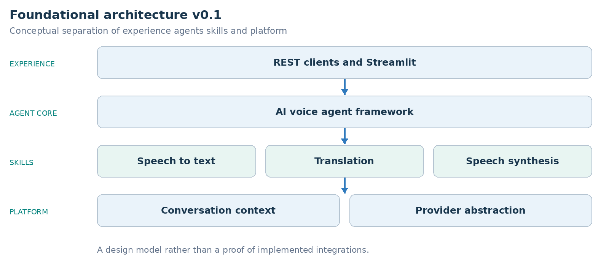

ARCHITECTURE & VISION BOOK · v0.1 · ENGLISH EDITION

Waaxalma

Founding vision and principles for an AI voice agent framework

28 June 2026 · Elimane DIOP · Laffaxexeul SA · Early development

**FOUNDING IDEA** Preserve the speaker’s intent across languages through an extensible framework of AI voice agents.

## 1. Overview

Waaxalma aims to enable natural multilingual communication. Its design seeks to preserve intent and conversational context, then produce natural speech in the target language. These are product goals, rather than guarantees of semantic accuracy or delivered durable memory.

The intended framework combines Large Language Models, speech recognition, speech synthesis and conversational memory. Waaxalma means “speak for me” in Wolof. This edition records the early vision and the historical sprint statuses, without importing capabilities from later releases.

### 2. Goals

Primary goals are an extensible voice agent framework, multilingual realtime conversations, a unified provider abstraction, context across sessions and a modular architecture for custom agents.

Secondary goals are on premises and cloud providers, voice cloning, streaming conversations, REST and WebSocket APIs and a Python SDK. Each requires its own implementation and validation.

### 3. Core principles

| Principle | Meaning |
| --- | --- |
| Agent first | Agents define application behavior. |
| Skills based | Reusable skills compose agent capabilities. |
| Provider independent | Agent contracts avoid direct dependency on one provider. |
| Conversation aware | Interactions belong to a conversation context. |
| Extensible | Add agents, Skills, providers and memory implementations through explicit boundaries. |

## 4. Architecture

The diagram is a conceptual architecture. Skills are capabilities, not a statement that every request traverses every block. Conversation context and provider abstraction support agent composition.

### 5. Roadmap

The original source records the following sprint statuses. They remain historical planning records, not new test results from this review.

| Stage | Capability | Historical status |
| --- | --- | --- |
| Sprint 1 | Core Translation API | Validated |
| Sprint 2 | Agent Framework | Validated |
| Sprint 3 | Multi Agent and Session Framework | Validated |
| Sprint 4 | Voice Pipeline | In progress |
| Sprint 5 | Conversation Memory | Planned |
| Sprint 6 | Streaming | Planned |
| Sprint 7 | Voice Clone | Planned |
| Sprint 8 | Meeting Assistant | Planned |

### 6. Future vision

The envisioned ecosystem covers multilingual conversations, meeting assistants, realtime interpreters, customer service, travel assistants and domain specific voice copilots. Developers would compose reusable capabilities rather than rebuild every application. These remain future use cases in this edition.

**VERSION FOCUS** v0.1 establishes intent, goals and design principles.

