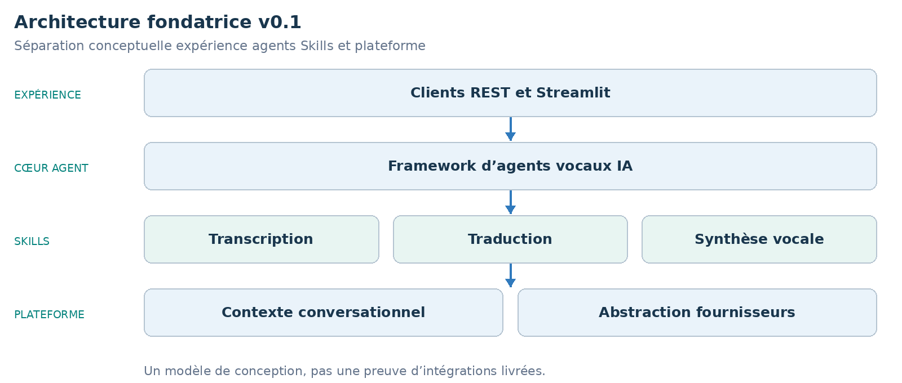

LIVRE D’ARCHITECTURE ET DE VISION · v0.1 · ÉDITION FRANÇAISE

Waaxalma

Vision fondatrice et principes d’un framework d’agents vocaux IA

28 juin 2026 · Elimane DIOP · Laffaxexeul SA · Développement initial

**IDÉE FONDATRICE** Préserver l’intention de la personne qui parle, d’une langue à l’autre, grâce à un framework extensible d’agents vocaux IA.

## 1. Présentation

Waaxalma vise une communication multilingue naturelle. Sa conception cherche à préserver l’intention et le contexte conversationnel, puis à produire une voix naturelle dans la langue cible. Ce sont des objectifs produit, pas des garanties de justesse sémantique ni de mémoire durable livrée.

Le framework envisagé combine grands modèles de langage, reconnaissance vocale, synthèse vocale et mémoire conversationnelle. Waaxalma signifie « parle pour moi » en wolof. Cette édition décrit la vision initiale et les statuts historiques des sprints, sans y ajouter les capacités des releases ultérieures.

### 2. Objectifs

Les objectifs principaux sont un framework vocal extensible, des conversations multilingues en temps réel, une abstraction unifiée des fournisseurs, un contexte conservé entre sessions et une architecture modulaire pour créer des agents spécifiques.

Les objectifs secondaires sont les fournisseurs locaux et cloud, le clonage vocal, les conversations en streaming, les API REST et WebSocket et un SDK Python. Chacun nécessite son implémentation et sa validation.

### 3. Principes directeurs

| Principe | Signification |
| --- | --- |
| Approche agent | Les agents définissent le comportement applicatif. |
| Composition par Skills | Les Skills réutilisables composent les capacités des agents. |
| Indépendance fournisseur | Les contrats agents évitent la dépendance directe à un fournisseur. |
| Conscience du contexte | Les interactions s’inscrivent dans un contexte conversationnel. |
| Extensibilité | Ajouter agents, Skills, fournisseurs et implémentations mémoire via des frontières explicites. |

## 4. Architecture

Le schéma présente une architecture conceptuelle. Les Skills sont des capacités ; chaque requête ne traverse pas nécessairement chaque bloc. Contexte conversationnel et abstraction fournisseurs soutiennent la composition des agents.

### 5. Roadmap

La source d’origine consigne les statuts ci-dessous. Ils restent des éléments historiques de planification, pas de nouveaux résultats de tests issus de cette revue.

| Étape | Capacité | Statut historique |
| --- | --- | --- |
| Sprint 1 | API de traduction | Validé |
| Sprint 2 | Framework agents | Validé |
| Sprint 3 | Framework multiagents et sessions | Validé |
| Sprint 4 | Pipeline vocal | En cours |
| Sprint 5 | Mémoire conversationnelle | Prévu |
| Sprint 6 | Streaming | Prévu |
| Sprint 7 | Clonage vocal | Prévu |
| Sprint 8 | Assistant de réunion | Prévu |

### 6. Vision future

L’écosystème envisagé couvre conversations multilingues, assistants de réunion, interprètes temps réel, service client, assistants de voyage et copilotes vocaux spécialisés. Les développeurs composeraient des capacités réutilisables au lieu de reconstruire chaque application. Ces usages restent futurs dans cette édition.

**PÉRIMÈTRE DE LA VERSION** La v0.1 établit intention, objectifs et principes de conception.

