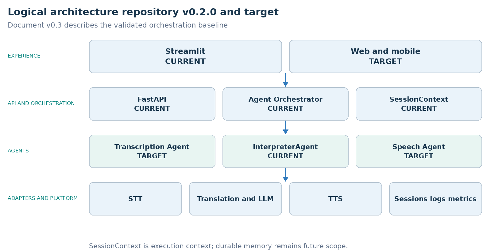
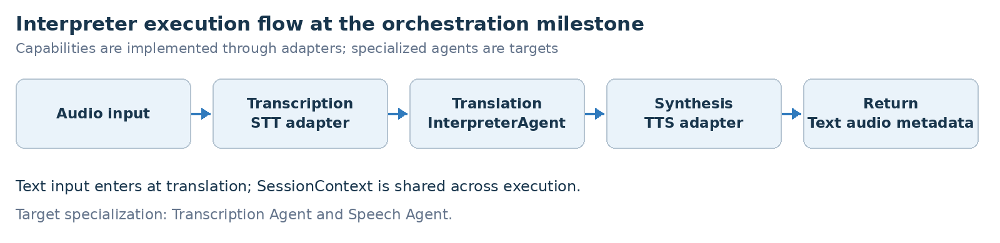

ARCHITECTURE & VISION BOOK · v0.3 · ENGLISH EDITION

Waaxalma

From a voice translation prototype to a voice agent framework

23 July 2026 · Updated architecture · Repository baseline v0.2.0

**VISION** Waaxalma (“speak for me”) turns speech, particularly in Wolof, into English text and audio. It progressively evolves into a reusable framework for composing and observing voice agents.

## 1. Vision and scope

Capture speech, preserve intent, produce an actionable translation and return natural sounding speech. Each capability should improve independently without breaking public interfaces. The document version v0.3 describes the orchestration baseline v0.2.0; it does not claim Reliability v0.3.0 is already delivered.

Inputs: microphone audio or a file; text mode supports tests and non voice use cases.

Outputs: source text, English translation, English audio and session metadata.

Direction: replace business service calls inside routes with an orchestrated agent pipeline.

### 2. Foundation already built

| Layer | Current state | Architectural meaning |
| --- | --- | --- |
| API | FastAPI | Text and voice routes delegate to shared orchestration. |
| Interface | Streamlit | Microphone journey validated in the Python UI. |
| Orchestration | Agent Orchestrator | Typed inputs and results; source records validation in v0.2.0. |
| Session | SessionContext | Execution context: session_id, languages, shared data and metadata. |
| Agents and adapters | InterpreterAgent | Translation and synthesis through common contracts and adapters. |

### 3. Guiding principles

Keep FastAPI routes thin; agent code owns business decisions.

Access STT, translation and TTS through replaceable adapters.

Share execution context, identifier, errors, duration and results.

Design for minimal collection and explicit retention; do not persist audio without a defined need. These are design principles, not a security audit.

## 4. Current and target architecture

The original source identifies Agent Orchestrator and SessionContext as validated in repository v0.2.0. Transcription Agent, Speech Agent and web/mobile remain target specializations. SessionContext does not by itself establish persisted conversation memory.

### 5. Interpreter execution flows

**PIPELINE CONTRACT** A shared SessionContext accompanies typed AgentInput and AgentResult contracts. Agents do not depend directly on FastAPI. The flow shows capabilities; separate Transcription and Speech agents remain target scope.

## 6. Technical roadmap

The prototype and orchestration are recorded as validated. Reliability is next, before framework extensibility and production constraints. Pydantic contracts, orchestration, SessionContext, adapters and integration tests provide one shared execution model for text and voice.

| Stage | Status | Deliverables and exit criterion |
| --- | --- | --- |
| 0 Prototype | Validated | FastAPI, translation/TTS services, Streamlit, text and voice endpoints. Exit: functional journeys tested. |
| 1 Orchestration | Validated | Pydantic contracts, Agent Orchestrator, SessionContext, adapters, integration tests. Exit: shared text/voice pipeline. |
| 2 Reliability | Next | Audio validation, async, timeouts/retries, traces, short history, quality/latency metrics. Exit: observable errors and controlled recovery. |
| 3 Framework | Target | Agent registry, interchangeable providers, configurable pipelines, quality/context agents. Exit: add an agent without changing the API. |
| 4 Product | Target | Persisted sessions, security/privacy, CI/CD, packaging and operational observability. Exit: deployable and governed version. |

### 7. Git release map

The source maps architectural milestones to the following tags. Statuses are historical source records; this documentation review neither checks remote tags nor reruns the original validation.

| Git tag | Milestone | Historical status |
| --- | --- | --- |
| v0.1.0 | Prototype | Released |
| v0.2.0 | Agent Orchestration | Released |
| v0.3.0 | Reliability | Next |
| v0.4.0 | Framework | Target |
| v0.5.0 | Product Readiness | Target |
| v1.0.0 | Stable Release | Release target |

## 8. Recommended next slice Reliability

The proposed slice defines repository v0.3.0. It makes the existing journey dependable before adding new agents or production features.

Harden audio inputs: validate format, size, duration and empty or malformed recordings before orchestration.

Bound external calls: introduce async execution where useful, explicit timeouts and controlled retries per provider.

Normalize failures: map provider and pipeline errors to stable codes and predictable API responses.

Trace execution: capture latency by stage, provider, outcome and correlation through session_id.

Extend resilience tests: cover malformed audio, timeouts, provider unavailability and partial pipeline failure.

**DEFINITION OF DONE** Invalid inputs are rejected deterministically, provider latency is bounded, stage traces are correlated by session_id and success, timeout and provider failure tests pass. These are exit criteria for the next slice.

