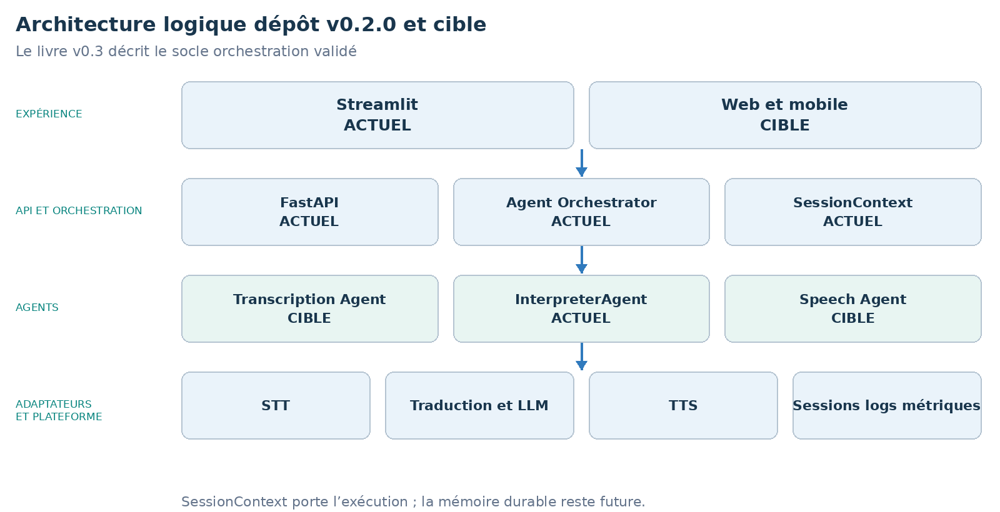
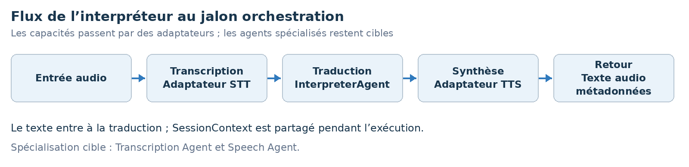

LIVRE D’ARCHITECTURE ET DE VISION · v0.3 · ÉDITION FRANÇAISE

Waaxalma

Du prototype de traduction vocale au framework d’agents vocaux

23 juillet 2026 · Architecture actualisée · Socle du dépôt v0.2.0

**VISION** Waaxalma (« parle pour moi ») transforme la parole, notamment en wolof, en texte et audio anglais. Il évolue progressivement vers un framework réutilisable pour composer et observer des agents vocaux.

## 1. Vision et périmètre

Capter la parole, préserver l’intention, produire une traduction exploitable et restituer une voix naturelle. Chaque capacité doit pouvoir évoluer sans casser les interfaces publiques. Le livre v0.3 décrit le socle orchestration v0.2.0 ; il n’annonce pas la livraison de Reliability v0.3.0.

Entrées : microphone ou fichier audio ; mode texte pour les tests et les usages sans voix.

Sorties : texte source, traduction anglaise, audio anglais et métadonnées de session.

Direction : déléguer le traitement métier des routes à un pipeline d’agents orchestré.

### 2. Fondations construites

| Couche | État actuel | Rôle architectural |
| --- | --- | --- |
| API | FastAPI | Les routes texte et voix délèguent à une orchestration commune. |
| Interface | Streamlit | Parcours microphone validé dans l’interface Python. |
| Orchestration | Agent Orchestrator | Entrées et résultats typés ; validation v0.2.0 consignée dans la source. |
| Session | SessionContext | Contexte d’exécution : session_id, langues, données partagées et métadonnées. |
| Agents et adaptateurs | InterpreterAgent | Traduction et synthèse via contrats et adaptateurs communs. |

### 3. Principes directeurs

Garder les routes FastAPI simples ; les agents portent les décisions métier.

Accéder à STT, traduction et TTS via des adaptateurs remplaçables.

Partager contexte d’exécution, identifiant, erreurs, durée et résultats.

Concevoir collecte minimale et rétention explicite ; ne pas persister l’audio sans besoin défini. Ce sont des principes, pas un audit de sécurité.

## 4. Architecture actuelle et cible

La source identifie Agent Orchestrator et SessionContext comme validés dans le dépôt v0.2.0. Transcription Agent, Speech Agent et web/mobile restent des cibles. SessionContext ne constitue pas à lui seul une mémoire conversationnelle persistante.

### 5. Flux d’exécution de l’interpréteur

**CONTRAT DU PIPELINE** Un SessionContext partagé accompagne les contrats typés AgentInput et AgentResult. Les agents ne dépendent pas directement de FastAPI. Le flux montre des capacités ; les agents Transcription et Speech séparés restent cibles.

## 6. Roadmap technique

Prototype et orchestration sont consignés comme validés. La fiabilité vient ensuite, avant extensibilité et contraintes de production. Contrats Pydantic, orchestration, SessionContext, adaptateurs et tests d’intégration fournissent un modèle d’exécution partagé pour texte et voix.

| Étape | Statut | Livrables et critère de sortie |
| --- | --- | --- |
| 0 Prototype | Validé | FastAPI, services traduction/TTS, Streamlit, endpoints texte/voix. Sortie : parcours fonctionnels testés. |
| 1 Orchestration | Validé | Contrats Pydantic, Agent Orchestrator, SessionContext, adaptateurs, tests d’intégration. Sortie : pipeline texte/voix commun. |
| 2 Fiabilité | Prochaine | Validation audio, async, timeouts/retries, traces, historique court, métriques qualité/latence. Sortie : erreurs observables et reprise contrôlée. |
| 3 Framework | Cible | Registre d’agents, fournisseurs interchangeables, pipelines configurables, agents qualité/contexte. Sortie : ajout d’un agent sans modifier l’API. |
| 4 Produit | Cible | Sessions persistantes, sécurité/confidentialité, CI/CD, packaging et observabilité opérationnelle. Sortie : version déployable et gouvernée. |

### 7. Carte des releases Git

La source associe les jalons aux tags ci-dessous. Les statuts sont historiques ; cette revue documentaire ne vérifie pas les tags distants et ne réexécute pas leur validation.

| Tag Git | Jalon | Statut historique |
| --- | --- | --- |
| v0.1.0 | Prototype | Publié |
| v0.2.0 | Orchestration agents | Publié |
| v0.3.0 | Fiabilité | Prochain |
| v0.4.0 | Framework | Cible |
| v0.5.0 | Préparation à la production | Cible |
| v1.0.0 | Release stable | Objectif de release |

## 8. Prochaine slice recommandée Fiabilité

La slice proposée définit le périmètre du dépôt v0.3.0. Elle fiabilise le parcours existant avant l’ajout d’agents ou de fonctions de production.

Valider les entrées audio : format, taille, durée, enregistrements vides ou malformés avant orchestration.

Borner les appels externes : async lorsque pertinent, timeouts explicites et retries contrôlés par fournisseur.

Normaliser les échecs : associer les erreurs fournisseur/pipeline à des codes stables et des réponses prévisibles.

Tracer l’exécution : latence par étape, fournisseur, résultat et corrélation par session_id.

Étendre les tests de résilience : audio malformé, timeout, indisponibilité fournisseur et échec partiel du pipeline.

**CRITÈRES D’ACHÈVEMENT** Les entrées invalides sont rejetées de façon déterministe, la latence fournisseur est bornée, les traces d’étapes sont corrélées par session_id et les tests succès, timeout et panne fournisseur passent. Ce sont les critères de sortie de la prochaine slice.

