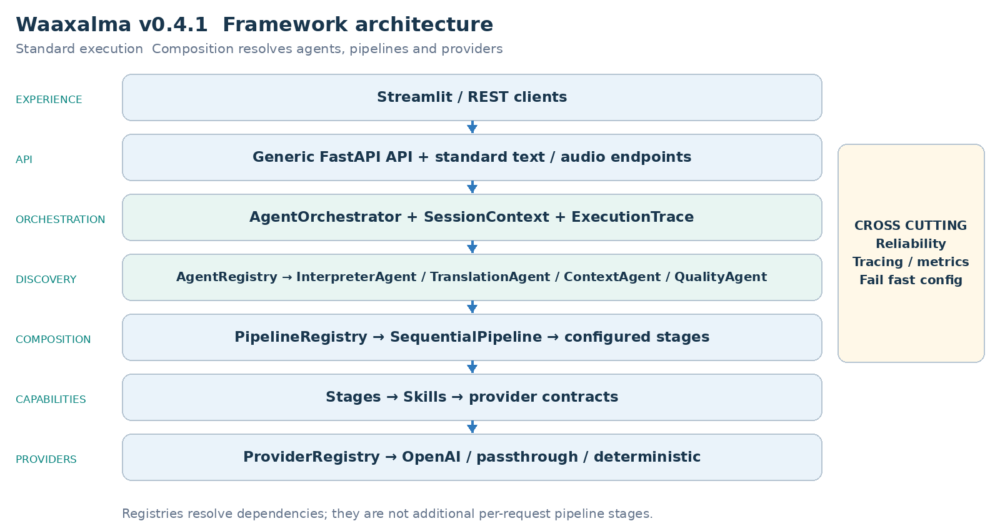
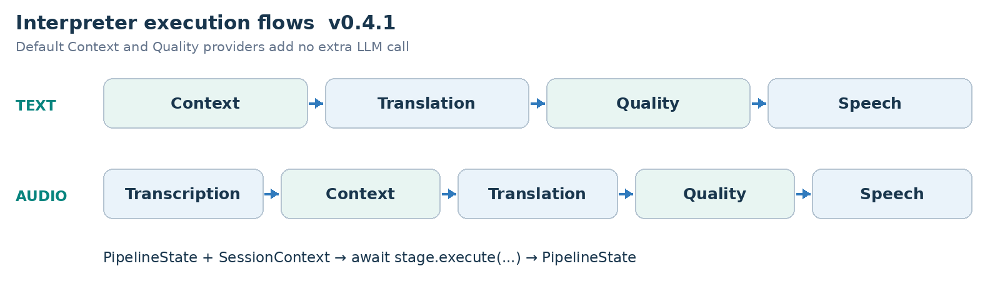
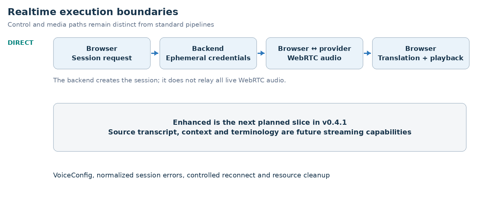

ARCHITECTURE & VISION BOOK  ·  v0.4.1  ·  ENGLISH EDITION

# Waaxalma Architecture and Vision Book v0.4.1 EN

Realtime Translation and Voice Configuration

26 September 2026  ·  Realtime Translation and Voice Configuration

**VISION** Waaxalma (“speak for me”) turns speech, particularly in Wolof, into understandable translated text and natural audio. The product seeks to preserve intent; the framework separates replaceable agents, pipelines and provider capabilities.

## 1. Vision and scope

This edition records the v0.4.1 milestone. It retains the architecture template from v0.4 and the capabilities delivered at this point; later milestones remain future work in this historical edition.

- RealtimeTranslationService resolves RealtimeTranslationProvider through ProviderRegistry. The OpenAI adapter creates a short-lived session using gpt-realtime-translate.
- VoiceConfig exposes provider and voice_id for standard speech; realtime voice remains optional and provider-specific.

### 2. Foundation now built

| Layer | Implementation | Meaning |
| --- | --- | --- |
| API | FastAPI | Generic registered-agent execution; text/voice routes. |
| Orchestration | AgentOrchestrator | Results, errors, timing and cancellation. |
| Discovery | AgentRegistry / ProviderRegistry | Explicit resolution by name and capability. |
| Composition | PipelineRegistry / SequentialPipeline | Ordered reusable stages. |
| Realtime | Direct | Dedicated session and live capability paths. |

### 3. Guiding principles

- Extend through contracts, registration and composition; fail early for unknown providers/pipelines.
- Skills depend on capability contracts. Reliability and observability stay cross-cutting. Context/Quality defaults add no extra LLM call.
- Separate standard workflows, realtime transports and browser devices; describe validation limits explicitly.

## 4. Current architecture

The composition root assembles concrete providers, Skills, stages, pipelines and agents. Registries resolve dependencies rather than adding processing stages to every request.

AgentOrchestrator executes registered agents; InterpreterAgent receives its configured text/audio pipelines. Realtime services, where delivered, remain separate from this standard chain.

### 5. Interpreter execution flows

**PIPELINE CONTRACT** Each stage receives PipelineState and SessionContext and returns updated state. SequentialPipeline awaits stages in order; configured workflows can evolve without rewriting InterpreterAgent.

## 6. Framework extensibility model

Extension happens through explicit registration and composition, preserving the generic API and orchestration core. Provider adapters can change behind capability contracts.

| Extension | Required change | Boundary preserved |
| --- | --- | --- |
| New agent | BaseAgent + AgentRegistry | API / AgentOrchestrator |
| New provider | Implement capability contract; register capability + name. | Skill / Agent / API |
| New pipeline | Compose stages and register its name. | SequentialPipeline |
| New stage | PipelineStage | InterpreterAgent / API |
| Context/quality strategy | ContextProvider / QualityProvider | Configured stage structure. |

RealtimeTranslationProvider is resolved by capability and name without routing live sessions through SequentialPipeline.

### 7. Context and Quality as first class capabilities

- PassthroughContextProvider preserves source text/metadata. TranslationStage prefers enriched_text when supplied and preserves source_text.
- DeterministicQualityProvider evaluates structure, not semantic translation correctness. accepted, score, issues and quality metadata are returned; rejection does not create an implicit blocking policy.

- Direct bypasses standard Context/Quality to keep its provider-native latency path.

### Realtime architecture and execution

Direct creates a short-lived provider session through the backend. The browser then negotiates SDP and WebRTC and receives live translated text/audio. Session creation and browser/provider media exchange are distinct responsibilities.

- VoiceConfig exposes provider and voice_id for standard speech; realtime voice remains optional and provider-specific.
- Authentication, rate-limit, timeout, provider 5xx and network failures map to stable realtime errors. One reconnect attempt is the default; it creates a fresh secret.
- Stop closes data channel, peer connection, microphone tracks, translated playback and local audio monitors without triggering reconnect.

### Direct historical measured baseline

| Signal | Observed value |
| --- | --- |
| Session request | ~1.61 s |
| Microphone acquisition | ~0.47 s |
| WebRTC establishment | ~1.84 s |
| Speech → first translated text | ~0.39 s |
| Speech → first translated audio | ~1.35 s |
| Translated text → audio | ~0.96 s |

These are historical local Direct observations. Startup, recognition and audio latency are separate measurements, not SLAs or newly rerun benchmarks.

## 8. Reliability and observability inheritance

- Provider retry/timeout policies remain centralized where supported. AgentOrchestrator normalizes failures and preserves cancellation.
- ExecutionTrace records stage/provider duration, outcome and error information. Prometheus covers executions, stage timing and retries.

Realtime session creation uses normalized errors and provider/model/outcome metrics. Browser QoE reports bounded latency signals without request_id, session_id or client_secret metric labels. Stop releases live resources; reconnect uses a new ephemeral secret.

## 9. Technical roadmap

Each milestone builds on the preceding architecture. The table records capability delivery, not an assertion that an unseen public Git tag exists. Future scope is preserved from the historical milestone.

| Milestone | Position in this edition |
| --- | --- |
| Prototype and orchestration | Foundation |
| Reliability | Foundation |
| Framework Next | Foundation |
| Realtime Direct | Milestone documented |
| Realtime Enhanced | Future at this version |
| Universal Audio Output | Future at this version |
| Device Control | Future at this version |
| Product Readiness | Future at this version |
| Stable Framework | Future at this version |

### 10. Git release map

| Version | Milestone |
| --- | --- |
| v0.1.0 | Prototype |
| v0.2.0 | Agent Orchestration |
| v0.3.0 | Reliability |
| v0.4.0 | Framework Next |
| v0.4.1 | Realtime Translation and Voice Configuration |
| v0.4.2 | Realtime Enhanced Streaming |
| v0.4.3 | Universal Audio Output and Conferencing Bridge |
| v0.4.4 | Conferencing Audio and Device Control |
| v0.5.0 | Product Readiness |
| v1.0.0 | Stable Framework Release |

## 11. v0.4.1 definition of done

- RealtimeTranslationService resolves RealtimeTranslationProvider through ProviderRegistry. The OpenAI adapter creates a short-lived session using gpt-realtime-translate.
- VoiceConfig exposes provider and voice_id for standard speech; realtime voice remains optional and provider-specific.
- Authentication, rate-limit, timeout, provider 5xx and network failures map to stable realtime errors. One reconnect attempt is the default; it creates a fresh secret.
- Stop closes data channel, peer connection, microphone tracks, translated playback and local audio monitors without triggering reconnect.

- Standard agents, provider selection and configured pipelines preserve the v0.4 extension boundaries and Context/Quality metadata.

- Dedicated live sessions remain independent from standard orchestration; stop/error cleanup and normalized failures stay observable.

**VALIDATION RECORD** Historical full backend regression: 109 tests passed; the existing Standard Streamlit journey was manually validated.

### 12. Recommended next slice

Realtime Enhanced is next: source transcript, terminology/context, streaming translation/TTS and a shared Direct/Enhanced benchmark. It is a planned architecture, not delivered v0.4.1 behavior.

### Product readiness direction

Persistent conversation state, privacy/security boundaries, repeatable settings/credentials, CI packaging and production signals remain the operational roadmap. Later implementation chooses client isolation, not implicit authentication; future roadmap aspirations are not delivered guarantees of this historical version.

**FRAMEWORK PRINCIPLE** Add a capability through registration and composition without moving provider-specific or conferencing concerns into generic API/orchestration.
