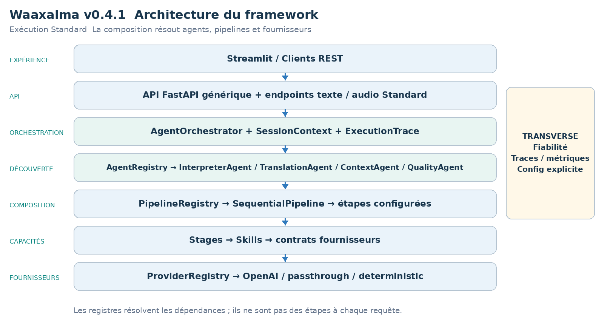
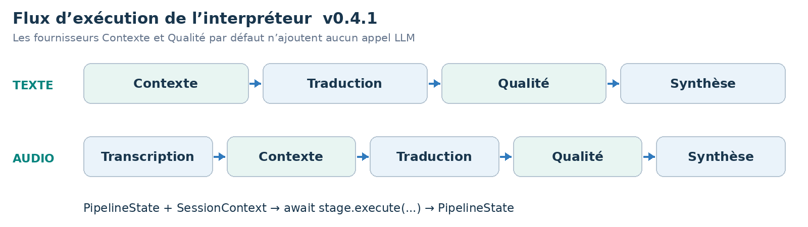
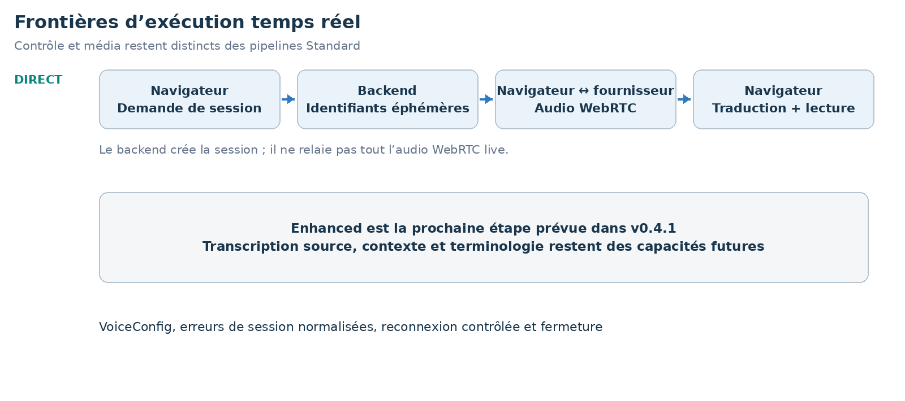

LIVRE D’ARCHITECTURE ET DE VISION  ·  v0.4.1  ·  ÉDITION FRANÇAISE

# Waaxalma Architecture and Vision Book v0.4.1 FR

Traduction temps réel et configuration de voix

26 septembre 2026  ·  Traduction temps réel et configuration de voix

**VISION** Waaxalma (« parle pour moi ») transforme la parole, notamment en wolof, en traduction compréhensible et en audio naturel. Le produit vise à préserver l’intention ; le framework sépare agents, pipelines et capacités fournisseurs remplaçables.

## 1. Vision et périmètre

Cette édition décrit le jalon v0.4.1. Elle reprend le gabarit v0.4 et les capacités livrées à cette étape ; les jalons ultérieurs restent des évolutions futures dans cette édition historique.

- RealtimeTranslationService résout RealtimeTranslationProvider via ProviderRegistry. L’adaptateur OpenAI crée une session éphémère avec gpt-realtime-translate.
- VoiceConfig expose provider et voice_id pour la synthèse Standard ; la voix realtime reste optionnelle et propre au fournisseur.

### 2. Fondations construites

| Couche | Implémentation | Rôle |
| --- | --- | --- |
| API | FastAPI | Exécution générique d’agents enregistrés ; routes texte/voix. |
| Orchestration | AgentOrchestrator | Résultats, erreurs, durée et annulation. |
| Découverte | AgentRegistry / ProviderRegistry | Résolution explicite par nom et capacité. |
| Composition | PipelineRegistry / SequentialPipeline | Étapes réutilisables ordonnées. |
| Temps réel | Direct | Chemins de sessions et capacités live dédiés. |

### 3. Principes directeurs

- Étendre par contrats, enregistrement et composition ; détecter tôt fournisseurs/pipelines inconnus.
- Les Skills dépendent de contrats de capacité. Fiabilité et observabilité restent transverses. Contexte/Qualité par défaut n’ajoutent aucun appel LLM.
- Séparer traitements Standard, transports temps réel et périphériques navigateur ; expliciter les limites de validation.

## 4. Architecture actuelle

La racine de composition assemble fournisseurs concrets, Skills, étapes, pipelines et agents. Les registres résolvent les dépendances sans ajouter d’étapes de traitement à chaque requête.

AgentOrchestrator exécute les agents enregistrés ; InterpreterAgent reçoit ses pipelines texte/audio configurés. Les services temps réel, lorsqu’ils sont livrés, restent séparés de cette chaîne Standard.

### 5. Flux d’exécution de l’interpréteur

**CONTRAT DU PIPELINE** Chaque étape reçoit PipelineState et SessionContext et retourne l’état mis à jour. SequentialPipeline attend les étapes dans l’ordre ; les workflows configurés évoluent sans réécrire InterpreterAgent.

## 6. Modèle d’extensibilité du framework

L’extension repose sur enregistrement et composition explicites, avec API générique et cœur d’orchestration préservés. Les adaptateurs fournisseurs changent derrière les contrats de capacité.

| Extension | Changement requis | Frontière préservée |
| --- | --- | --- |
| Nouvel agent | BaseAgent + AgentRegistry | API / AgentOrchestrator |
| Nouveau fournisseur | Implémenter le contrat de capacité ; enregistrer capacité + nom. | Skill / Agent / API |
| Nouveau pipeline | Composer les étapes et enregistrer le nom. | SequentialPipeline |
| Nouvelle étape | PipelineStage | InterpreterAgent / API |
| Stratégie contexte/qualité | ContextProvider / QualityProvider | Structure des étapes configurées. |

RealtimeTranslationProvider est résolu par capacité et nom sans faire passer les sessions live par SequentialPipeline.

### 7. Contexte et Qualité comme capacités à part entière

- PassthroughContextProvider préserve texte source/métadonnées. TranslationStage privilégie enriched_text lorsqu’il est fourni et conserve source_text.
- DeterministicQualityProvider évalue la structure, pas la justesse sémantique. accepted, score, issues et métadonnées qualité sont retournés ; le rejet ne crée pas de blocage implicite.

- Direct contourne Contexte/Qualité Standard pour préserver son chemin de latence natif.

### Architecture et exécution temps réel

Direct crée une session fournisseur éphémère via le backend. Le navigateur négocie ensuite SDP et WebRTC et reçoit texte/audio traduits. Création de session et échange média navigateur/fournisseur sont distincts.

- VoiceConfig expose provider et voice_id pour la synthèse Standard ; la voix realtime reste optionnelle et propre au fournisseur.
- Authentification, rate-limit, timeout, erreurs 5xx fournisseur et réseau sont normalisés. Une tentative de reconnexion est prévue par défaut, avec un secret neuf.
- Stop ferme canal de données, connexion pair, pistes microphone, lecture traduite et moniteurs locaux sans déclencher de reconnexion.

### Mesures historiques Direct

| Signal | Valeur observée |
| --- | --- |
| Demande de session | ~1.61 s |
| Acquisition microphone | ~0.47 s |
| Établissement WebRTC | ~1.84 s |
| Parole → premier texte traduit | ~0.39 s |
| Parole → premier audio traduit | ~1.35 s |
| Texte traduit → audio | ~0.96 s |

Ces observations locales historiques concernent Direct. Démarrage, reconnaissance et audio sont mesurés séparément ; ce ne sont ni des SLA ni de nouveaux benchmarks.

## 8. Héritage de fiabilité et d’observabilité

- Les politiques retry/timeout restent centralisées lorsqu’elles sont compatibles. AgentOrchestrator normalise les erreurs et préserve l’annulation.
- ExecutionTrace décrit durées d’étape/fournisseur, résultat et erreurs. Prometheus couvre exécutions, durées et retries.

La création realtime utilise erreurs normalisées et métriques fournisseur/modèle/résultat. La QoE navigateur rapporte des latences bornées sans labels request_id, session_id ni client_secret. Stop libère les ressources ; une reconnexion utilise un nouveau secret.

## 9. Roadmap technique

Chaque jalon s’appuie sur l’architecture précédente. Le tableau décrit les capacités livrées, sans attester un tag public non vérifié. Le périmètre futur est conservé selon le jalon historique.

| Jalon | Position dans cette édition |
| --- | --- |
| Prototype et orchestration | Fondation |
| Fiabilité | Fondation |
| Framework Next | Fondation |
| Realtime Direct | Jalon documenté |
| Realtime Enhanced | Futur à cette version |
| Sortie audio universelle | Futur à cette version |
| Contrôle des périphériques | Futur à cette version |
| Product Readiness | Futur à cette version |
| Framework stable | Futur à cette version |

### 10. Carte des releases Git

| Version | Jalon |
| --- | --- |
| v0.1.0 | Prototype |
| v0.2.0 | Orchestration agents |
| v0.3.0 | Fiabilité |
| v0.4.0 | Framework Next |
| v0.4.1 | Traduction temps réel et configuration de voix |
| v0.4.2 | Streaming Realtime Enhanced |
| v0.4.3 | Sortie audio universelle et pont de conférence |
| v0.4.4 | Audio de conférence et contrôle des périphériques |
| v0.5.0 | Préparation à la production |
| v1.0.0 | Framework stable |

## 11. Critères d’achèvement v0.4.1

- RealtimeTranslationService résout RealtimeTranslationProvider via ProviderRegistry. L’adaptateur OpenAI crée une session éphémère avec gpt-realtime-translate.
- VoiceConfig expose provider et voice_id pour la synthèse Standard ; la voix realtime reste optionnelle et propre au fournisseur.
- Authentification, rate-limit, timeout, erreurs 5xx fournisseur et réseau sont normalisés. Une tentative de reconnexion est prévue par défaut, avec un secret neuf.
- Stop ferme canal de données, connexion pair, pistes microphone, lecture traduite et moniteurs locaux sans déclencher de reconnexion.

- Agents Standard, sélection des fournisseurs et pipelines configurés préservent les frontières v0.4 et métadonnées Contexte/Qualité.

- Les sessions live restent indépendantes de l’orchestration Standard ; fermeture sur arrêt/erreur et erreurs normalisées restent observables.

**PREUVES DE VALIDATION** Régression backend historique complète : 109 tests réussis ; parcours Standard Streamlit existant validé manuellement.

### 12. Prochaine étape recommandée

Realtime Enhanced est la suite : texte source, terminologie/contexte, traduction/TTS en streaming et benchmark partagé. Il s’agit d’une architecture prévue, pas d’un comportement livré en v0.4.1.

### Direction de préparation à la production

État conversationnel persistant, frontières confidentialité/sécurité, settings/secrets répétables, CI/packaging et signaux de production restent la roadmap opérationnelle. L’implémentation ultérieure choisira l’isolation client, pas une authentification implicite ; ces orientations ne sont pas des garanties livrées dans cette version historique.

**PRINCIPE DU FRAMEWORK** Ajouter une capacité par enregistrement et composition sans déplacer les détails fournisseur ou conférence dans l’API/orchestration générique.
