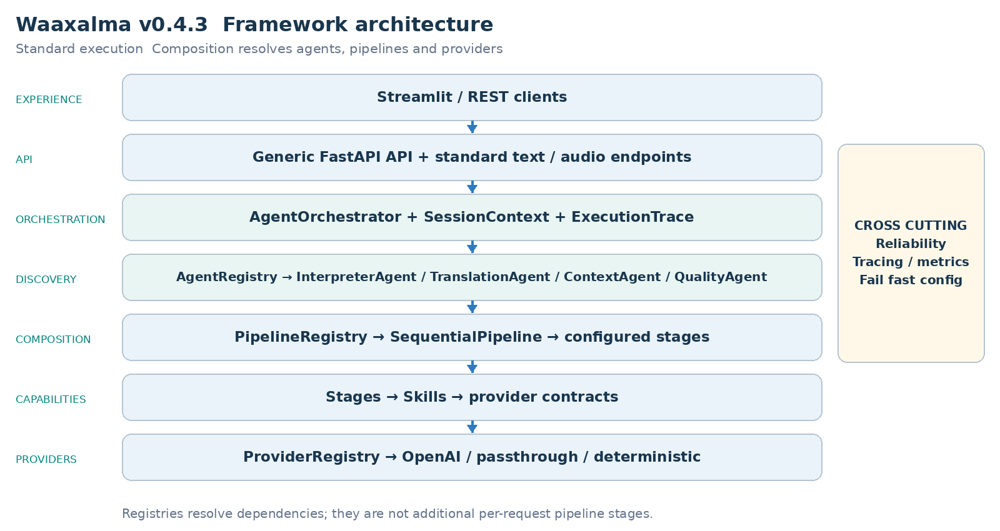
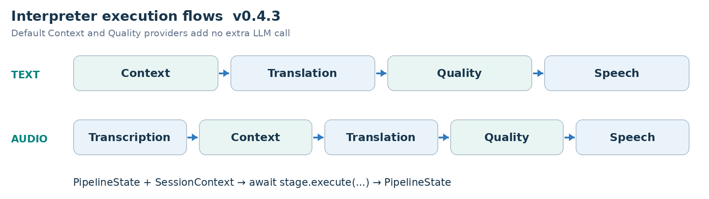
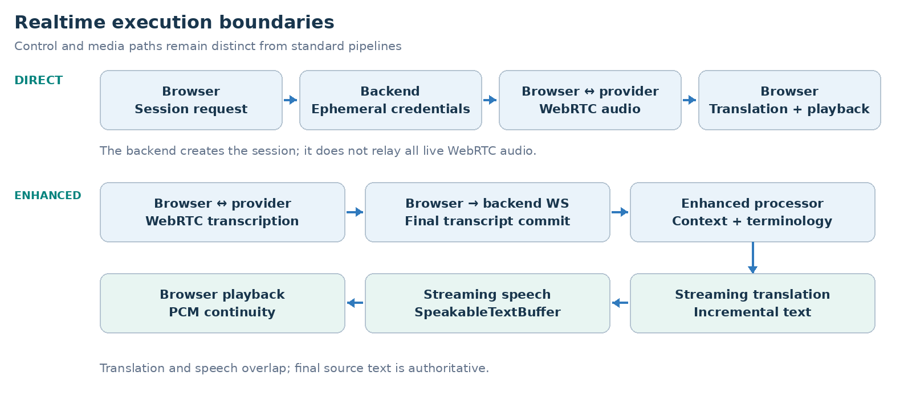
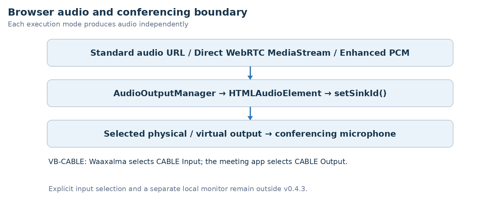

ARCHITECTURE & VISION BOOK  ·  v0.4.3  ·  ENGLISH EDITION

# Waaxalma Architecture and Vision Book v0.4.3 EN

Universal Audio Output and Conferencing Bridge

1 October 2026  ·  Universal Audio Output and Conferencing Bridge

**VISION** Waaxalma (“speak for me”) turns speech, particularly in Wolof, into understandable translated text and natural audio. The product seeks to preserve intent; the framework separates replaceable agents, pipelines and provider capabilities.

## 1. Vision and scope

This edition records the v0.4.3 milestone. It retains the architecture template from v0.4 and the capabilities delivered at this point; later milestones remain future work in this historical edition.

- AudioOutputManager is a shared browser output layer, not a merged execution pipeline. Each mode uses managed HTML audio playback and setSinkId() when supported.
- enumerateDevices() may require permission before showing non-default outputs. The selected output persists browser-side; a missing device falls back to the browser default. Stop/unload release playback resources.

### 2. Foundation now built

| Layer | Implementation | Meaning |
| --- | --- | --- |
| API | FastAPI | Generic registered-agent execution; text/voice routes. |
| Orchestration | AgentOrchestrator | Results, errors, timing and cancellation. |
| Discovery | AgentRegistry / ProviderRegistry | Explicit resolution by name and capability. |
| Composition | PipelineRegistry / SequentialPipeline | Ordered reusable stages. |
| Realtime | Direct / Enhanced | Dedicated session and live capability paths. |
| Audio devices | AudioOutputManager | Browser-side device integration. |

### 3. Guiding principles

- Extend through contracts, registration and composition; fail early for unknown providers/pipelines.
- Skills depend on capability contracts. Reliability and observability stay cross-cutting. Context/Quality defaults add no extra LLM call.
- Separate standard workflows, realtime transports and browser devices; describe validation limits explicitly.

## 4. Current architecture

The composition root assembles concrete providers, Skills, stages, pipelines and agents. Registries resolve dependencies rather than adding processing stages to every request.

AgentOrchestrator executes registered agents; InterpreterAgent receives its configured text/audio pipelines. Realtime services, where delivered, remain separate from this standard chain.

### 5. Interpreter execution flows

**PIPELINE CONTRACT** Each stage receives PipelineState and SessionContext and returns updated state. SequentialPipeline awaits stages in order; configured workflows can evolve without rewriting InterpreterAgent.

## 6. Framework extensibility model

Extension happens through explicit registration and composition, preserving the generic API and orchestration core. Provider adapters can change behind capability contracts.

| Extension | Required change | Boundary preserved |
| --- | --- | --- |
| New agent | BaseAgent + AgentRegistry | API / AgentOrchestrator |
| New provider | Implement capability contract; register capability + name. | Skill / Agent / API |
| New pipeline | Compose stages and register its name. | SequentialPipeline |
| New stage | PipelineStage | InterpreterAgent / API |
| Context/quality strategy | ContextProvider / QualityProvider | Configured stage structure. |

RealtimeTranslationProvider is resolved by capability and name without routing live sessions through SequentialPipeline.

StreamingTranscriptionProvider, StreamingTranslationProvider and StreamingSpeechProvider isolate Enhanced adapters from processor orchestration and playback.

### 7. Context and Quality as first class capabilities

- PassthroughContextProvider preserves source text/metadata. TranslationStage prefers enriched_text when supplied and preserves source_text.
- DeterministicQualityProvider evaluates structure, not semantic translation correctness. accepted, score, issues and quality metadata are returned; rejection does not create an implicit blocking policy.

- Direct bypasses standard Context/Quality to keep its provider-native latency path.

- Enhanced uses terminology and three prior final source segments as reference-only context; it does not add an extra semantic quality evaluator.

### Realtime architecture and execution

Direct creates a short-lived provider session through the backend. The browser then negotiates SDP and WebRTC and receives live translated text/audio. Session creation and browser/provider media exchange are distinct responsibilities.

Enhanced creates an ephemeral transcription session, commits final text over /api/realtime/enhanced/stream, and composes streaming translation and TTS. The default adapters use gpt-live-transcribe, gpt-4.1-mini and gpt-4o-mini-tts; these names record the historical configuration, not a new provider availability guarantee.

| Responsibility | Execution boundary |
| --- | --- |
| Session setup | Backend issues an ephemeral provider credential. |
| Direct media | Browser and provider exchange WebRTC media. |
| Enhanced orchestration | Final transcript → streaming translation → TTS. |

### Realtime measurements and transcript handling

### Direct historical measured baseline

| Signal | Observed value |
| --- | --- |
| Session request | ~1.61 s |
| Microphone acquisition | ~0.47 s |
| WebRTC establishment | ~1.84 s |
| Speech → first translated text | ~0.39 s |
| Speech → first translated audio | ~1.35 s |
| Translated text → audio | ~0.96 s |

### Enhanced historical warm path sample

| Metric | p50 | p95 |
| --- | --- | --- |
| Commit → translation | ~0.55 s | ~0.75 s |
| Translation → audio | ~0.60 s | ~0.81 s |
| Commit → audio | ~1.17 s | ~1.46 s |
| TTS start → audio | ~0.51 s | ~0.69 s |

These are historical local observations: Enhanced used a ten-segment warm-path sample. Startup, recognition, translation and audio latency are separate measurements. They are not SLAs or newly rerun benchmarks.

### Final transcript and context contract

- Terminology and the previous three final source segments are reference-only context. They are not translated again. Source language, STT prompt and keywords are configurable.
- SpeakableTextBuffer overlaps translation and TTS. PCM16 carry-byte continuity and a 20 ms jitter buffer preserve playback. The browser commits after an approximately 320 ms RMS silence window.

### Audio output and conferencing

- AudioOutputManager is a shared browser output layer, not a merged execution pipeline. Each mode uses managed HTML audio playback and setSinkId() when supported.
- enumerateDevices() may require permission before showing non-default outputs. The selected output persists browser-side; a missing device falls back to the browser default. Stop/unload release playback resources.
- Enhanced routes scheduled Web Audio through MediaStreamAudioDestinationNode. Standard uses its audio URL; Direct attaches its translated WebRTC stream. Streamlit uses st.iframe.
- VB-CABLE maps Waaxalma CABLE Input to the meeting microphone CABLE Output. A real Microsoft Teams call succeeded with Edge and a remote participant heard the translation.

The tested Chrome setup exposed the virtual output after permission, but remote Teams audio failed. Edge is the historical validated browser. Native Teams SDK, inbound/bidirectional audio, explicit input and separate local monitoring are outside this milestone.

| Mode | Audio bridge |
| --- | --- |
| Standard | Audio URL → managed HTML audio element. |
| Direct | WebRTC translated MediaStream → managed playback. |
| Enhanced | Web Audio → MediaStream destination → managed playback. |
| Conferencing | CABLE Input → VB-CABLE → CABLE Output meeting microphone. |

## 8. Reliability and observability inheritance

- Provider retry/timeout policies remain centralized where supported. AgentOrchestrator normalizes failures and preserves cancellation.
- ExecutionTrace records stage/provider duration, outcome and error information. Prometheus covers executions, stage timing and retries.

Realtime session creation uses normalized errors and provider/model/outcome metrics. Browser QoE reports bounded latency signals without request_id, session_id or client_secret metric labels. Stop releases live resources; reconnect uses a new ephemeral secret.

Per-utterance metrics separate recognition, translation and audio. Detailed backend timings move to DEBUG; WebSocket disconnects terminate output without secondary send failures.

## 9. Technical roadmap

Each milestone builds on the preceding architecture. The table records capability delivery, not an assertion that an unseen public Git tag exists. Future scope is preserved from the historical milestone.

| Milestone | Position in this edition |
| --- | --- |
| Prototype and orchestration | Foundation |
| Reliability | Foundation |
| Framework Next | Foundation |
| Realtime Direct | Foundation |
| Realtime Enhanced | Foundation |
| Universal Audio Output | Milestone documented |
| Device Control | Future at this version |
| Product Readiness | Future at this version |
| Stable Framework | Future at this version |

### 10. Git release map

| Version | Milestone |
| --- | --- |
| v0.1.0 | Prototype |
| v0.2.0 | Agent Orchestration |
| v0.3.0 | Reliability |
| v0.4.0 | Framework Next |
| v0.4.1 | Realtime Translation and Voice Configuration |
| v0.4.2 | Realtime Enhanced Streaming |
| v0.4.3 | Universal Audio Output and Conferencing Bridge |
| v0.4.4 | Conferencing Audio and Device Control |
| v0.5.0 | Product Readiness |
| v1.0.0 | Stable Framework Release |

## 11. v0.4.3 definition of done

- AudioOutputManager is a shared browser output layer, not a merged execution pipeline. Each mode uses managed HTML audio playback and setSinkId() when supported.
- enumerateDevices() may require permission before showing non-default outputs. The selected output persists browser-side; a missing device falls back to the browser default. Stop/unload release playback resources.
- Enhanced routes scheduled Web Audio through MediaStreamAudioDestinationNode. Standard uses its audio URL; Direct attaches its translated WebRTC stream. Streamlit uses st.iframe.
- VB-CABLE maps Waaxalma CABLE Input to the meeting microphone CABLE Output. A real Microsoft Teams call succeeded with Edge and a remote participant heard the translation.
- The tested Chrome setup exposed the virtual output after permission, but remote Teams audio failed. Edge is the historical validated browser. Native Teams SDK, inbound/bidirectional audio, explicit input and separate local monitoring are outside this milestone.

- Standard agents, provider selection and configured pipelines preserve the v0.4 extension boundaries and Context/Quality metadata.

- Dedicated live sessions remain independent from standard orchestration; stop/error cleanup and normalized failures stay observable.

**VALIDATION RECORD** Historical baseline: 216 passing backend tests from v0.4.2. The source required a fresh run before tagging v0.4.3 because changes were mainly browser-side.

### 12. Recommended next slice

An isolated follow-up can add explicit input selection, independent local monitoring and inbound/bidirectional conferencing before or alongside Product Readiness.

### Product readiness direction

Persistent conversation state, privacy/security boundaries, repeatable settings/credentials, CI packaging and production signals remain the operational roadmap. Later implementation chooses client isolation, not implicit authentication; future roadmap aspirations are not delivered guarantees of this historical version.

**FRAMEWORK PRINCIPLE** Add a capability through registration and composition without moving provider-specific or conferencing concerns into generic API/orchestration.
