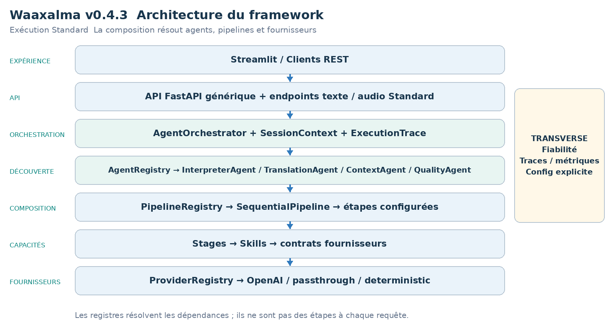
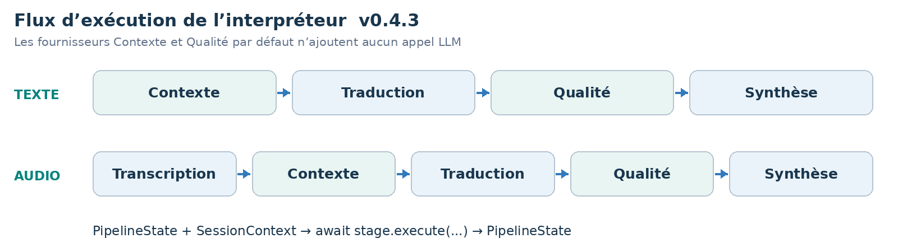
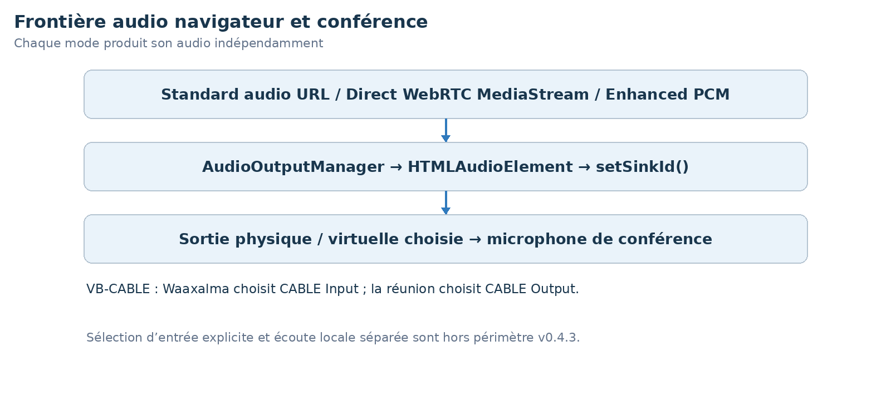

LIVRE D’ARCHITECTURE ET DE VISION  ·  v0.4.3  ·  ÉDITION FRANÇAISE

# Waaxalma Architecture and Vision Book v0.4.3 FR

Sortie audio universelle et pont de conférence

1 octobre 2026  ·  Sortie audio universelle et pont de conférence

**VISION** Waaxalma (« parle pour moi ») transforme la parole, notamment en wolof, en traduction compréhensible et en audio naturel. Le produit vise à préserver l’intention ; le framework sépare agents, pipelines et capacités fournisseurs remplaçables.

## 1. Vision et périmètre

Cette édition décrit le jalon v0.4.3. Elle reprend le gabarit v0.4 et les capacités livrées à cette étape ; les jalons ultérieurs restent des évolutions futures dans cette édition historique.

- AudioOutputManager est une couche de sortie navigateur partagée, pas un pipeline fusionné. Chaque mode utilise un élément audio géré et setSinkId() si disponible.
- enumerateDevices() peut nécessiter une permission avant d’afficher les sorties. Le choix est conservé côté navigateur ; un périphérique absent entraîne un retour au défaut. Stop/unload libèrent la lecture.

### 2. Fondations construites

| Couche | Implémentation | Rôle |
| --- | --- | --- |
| API | FastAPI | Exécution générique d’agents enregistrés ; routes texte/voix. |
| Orchestration | AgentOrchestrator | Résultats, erreurs, durée et annulation. |
| Découverte | AgentRegistry / ProviderRegistry | Résolution explicite par nom et capacité. |
| Composition | PipelineRegistry / SequentialPipeline | Étapes réutilisables ordonnées. |
| Temps réel | Direct / Enhanced | Chemins de sessions et capacités live dédiés. |
| Périphériques audio | AudioOutputManager | Intégration périphérique côté navigateur. |

### 3. Principes directeurs

- Étendre par contrats, enregistrement et composition ; détecter tôt fournisseurs/pipelines inconnus.
- Les Skills dépendent de contrats de capacité. Fiabilité et observabilité restent transverses. Contexte/Qualité par défaut n’ajoutent aucun appel LLM.
- Séparer traitements Standard, transports temps réel et périphériques navigateur ; expliciter les limites de validation.

## 4. Architecture actuelle

La racine de composition assemble fournisseurs concrets, Skills, étapes, pipelines et agents. Les registres résolvent les dépendances sans ajouter d’étapes de traitement à chaque requête.

AgentOrchestrator exécute les agents enregistrés ; InterpreterAgent reçoit ses pipelines texte/audio configurés. Les services temps réel, lorsqu’ils sont livrés, restent séparés de cette chaîne Standard.

### 5. Flux d’exécution de l’interpréteur

**CONTRAT DU PIPELINE** Chaque étape reçoit PipelineState et SessionContext et retourne l’état mis à jour. SequentialPipeline attend les étapes dans l’ordre ; les workflows configurés évoluent sans réécrire InterpreterAgent.

## 6. Modèle d’extensibilité du framework

L’extension repose sur enregistrement et composition explicites, avec API générique et cœur d’orchestration préservés. Les adaptateurs fournisseurs changent derrière les contrats de capacité.

| Extension | Changement requis | Frontière préservée |
| --- | --- | --- |
| Nouvel agent | BaseAgent + AgentRegistry | API / AgentOrchestrator |
| Nouveau fournisseur | Implémenter le contrat de capacité ; enregistrer capacité + nom. | Skill / Agent / API |
| Nouveau pipeline | Composer les étapes et enregistrer le nom. | SequentialPipeline |
| Nouvelle étape | PipelineStage | InterpreterAgent / API |
| Stratégie contexte/qualité | ContextProvider / QualityProvider | Structure des étapes configurées. |

RealtimeTranslationProvider est résolu par capacité et nom sans faire passer les sessions live par SequentialPipeline.

StreamingTranscriptionProvider, StreamingTranslationProvider et StreamingSpeechProvider isolent les adaptateurs Enhanced de l’orchestration et de la lecture.

### 7. Contexte et Qualité comme capacités à part entière

- PassthroughContextProvider préserve texte source/métadonnées. TranslationStage privilégie enriched_text lorsqu’il est fourni et conserve source_text.
- DeterministicQualityProvider évalue la structure, pas la justesse sémantique. accepted, score, issues et métadonnées qualité sont retournés ; le rejet ne crée pas de blocage implicite.

- Direct contourne Contexte/Qualité Standard pour préserver son chemin de latence natif.

- Enhanced utilise terminologie et trois segments source finaux antérieurs comme référence ; il n’ajoute pas d’évaluateur sémantique supplémentaire.

### Architecture et exécution temps réel

Direct crée une session fournisseur éphémère via le backend. Le navigateur négocie ensuite SDP et WebRTC et reçoit texte/audio traduits. Création de session et échange média navigateur/fournisseur sont distincts.

Enhanced crée une session de transcription éphémère, commit le texte final sur /api/realtime/enhanced/stream et compose traduction/TTS en streaming. Les adaptateurs par défaut utilisent gpt-live-transcribe, gpt-4.1-mini et gpt-4o-mini-tts ; ces noms décrivent la configuration historique, pas une nouvelle garantie de disponibilité.

| Responsabilité | Frontière d’exécution |
| --- | --- |
| Création de session | Le backend obtient un secret fournisseur éphémère. |
| Média Direct | Navigateur et fournisseur échangent le média WebRTC. |
| Orchestration Enhanced | Transcription finale → traduction en streaming → TTS. |

### Mesures temps réel et traitement des transcriptions

### Mesures historiques Direct

| Signal | Valeur observée |
| --- | --- |
| Demande de session | ~1.61 s |
| Acquisition microphone | ~0.47 s |
| Établissement WebRTC | ~1.84 s |
| Parole → premier texte traduit | ~0.39 s |
| Parole → premier audio traduit | ~1.35 s |
| Texte traduit → audio | ~0.96 s |

### Échantillon historique Enhanced à chaud

| Métrique | p50 | p95 |
| --- | --- | --- |
| Commit → traduction | ~0.55 s | ~0.75 s |
| Traduction → audio | ~0.60 s | ~0.81 s |
| Commit → audio | ~1.17 s | ~1.46 s |
| Début TTS → audio | ~0.51 s | ~0.69 s |

Il s’agit d’observations locales historiques : Enhanced utilisait dix segments à chaud. Démarrage, reconnaissance, traduction et audio sont mesurés séparément. Ce ne sont ni des SLA ni de nouveaux benchmarks.

### Contrat de transcription finale et de contexte

- Terminologie et trois derniers segments source finaux servent uniquement de contexte de référence ; ils ne sont pas retraduits. Langue source, prompt STT et mots-clés sont configurables.
- SpeakableTextBuffer fait chevaucher traduction et TTS. Continuité PCM16 entre octets et jitter buffer de 20 ms préservent la lecture. Le navigateur commit après environ 320 ms de silence détecté par RMS.

### Sortie audio et conférence

- AudioOutputManager est une couche de sortie navigateur partagée, pas un pipeline fusionné. Chaque mode utilise un élément audio géré et setSinkId() si disponible.
- enumerateDevices() peut nécessiter une permission avant d’afficher les sorties. Le choix est conservé côté navigateur ; un périphérique absent entraîne un retour au défaut. Stop/unload libèrent la lecture.
- Enhanced passe le Web Audio planifié par MediaStreamAudioDestinationNode. Standard utilise son URL audio ; Direct attache son flux WebRTC traduit. Streamlit utilise st.iframe.
- VB-CABLE relie CABLE Input de Waaxalma au microphone CABLE Output de la réunion. Un appel Teams réel a réussi sous Edge, avec traduction entendue par un participant distant.

Chrome exposait la sortie virtuelle après permission dans le test, mais l’audio distant Teams échouait. Edge est la référence historique validée. SDK Teams, inbound/bidirectionnel, entrée explicite et écoute locale séparée sont hors de ce jalon.

| Mode | Pont audio |
| --- | --- |
| Standard | URL audio → élément HTML audio géré. |
| Direct | MediaStream WebRTC traduit → lecture gérée. |
| Enhanced | Web Audio → destination MediaStream → lecture gérée. |
| Conférence | CABLE Input → VB-CABLE → microphone CABLE Output de la réunion. |

## 8. Héritage de fiabilité et d’observabilité

- Les politiques retry/timeout restent centralisées lorsqu’elles sont compatibles. AgentOrchestrator normalise les erreurs et préserve l’annulation.
- ExecutionTrace décrit durées d’étape/fournisseur, résultat et erreurs. Prometheus couvre exécutions, durées et retries.

La création realtime utilise erreurs normalisées et métriques fournisseur/modèle/résultat. La QoE navigateur rapporte des latences bornées sans labels request_id, session_id ni client_secret. Stop libère les ressources ; une reconnexion utilise un nouveau secret.

Les métriques par énoncé séparent reconnaissance, traduction et audio. Les détails backend passent en DEBUG ; la déconnexion WebSocket arrête la sortie sans erreur secondaire d’envoi.

## 9. Roadmap technique

Chaque jalon s’appuie sur l’architecture précédente. Le tableau décrit les capacités livrées, sans attester un tag public non vérifié. Le périmètre futur est conservé selon le jalon historique.

| Jalon | Position dans cette édition |
| --- | --- |
| Prototype et orchestration | Fondation |
| Fiabilité | Fondation |
| Framework Next | Fondation |
| Realtime Direct | Fondation |
| Realtime Enhanced | Fondation |
| Sortie audio universelle | Jalon documenté |
| Contrôle des périphériques | Futur à cette version |
| Product Readiness | Futur à cette version |
| Framework stable | Futur à cette version |

### 10. Carte des releases Git

| Version | Jalon |
| --- | --- |
| v0.1.0 | Prototype |
| v0.2.0 | Orchestration agents |
| v0.3.0 | Fiabilité |
| v0.4.0 | Framework Next |
| v0.4.1 | Traduction temps réel et configuration de voix |
| v0.4.2 | Streaming Realtime Enhanced |
| v0.4.3 | Sortie audio universelle et pont de conférence |
| v0.4.4 | Audio de conférence et contrôle des périphériques |
| v0.5.0 | Préparation à la production |
| v1.0.0 | Framework stable |

## 11. Critères d’achèvement v0.4.3

- AudioOutputManager est une couche de sortie navigateur partagée, pas un pipeline fusionné. Chaque mode utilise un élément audio géré et setSinkId() si disponible.
- enumerateDevices() peut nécessiter une permission avant d’afficher les sorties. Le choix est conservé côté navigateur ; un périphérique absent entraîne un retour au défaut. Stop/unload libèrent la lecture.
- Enhanced passe le Web Audio planifié par MediaStreamAudioDestinationNode. Standard utilise son URL audio ; Direct attache son flux WebRTC traduit. Streamlit utilise st.iframe.
- VB-CABLE relie CABLE Input de Waaxalma au microphone CABLE Output de la réunion. Un appel Teams réel a réussi sous Edge, avec traduction entendue par un participant distant.
- Chrome exposait la sortie virtuelle après permission dans le test, mais l’audio distant Teams échouait. Edge est la référence historique validée. SDK Teams, inbound/bidirectionnel, entrée explicite et écoute locale séparée sont hors de ce jalon.

- Agents Standard, sélection des fournisseurs et pipelines configurés préservent les frontières v0.4 et métadonnées Contexte/Qualité.

- Les sessions live restent indépendantes de l’orchestration Standard ; fermeture sur arrêt/erreur et erreurs normalisées restent observables.

**PREUVES DE VALIDATION** Socle historique : 216 tests backend réussis depuis v0.4.2. La source demandait une réexécution avant tag v0.4.3, les changements étant surtout navigateur.

### 12. Prochaine étape recommandée

Une suite isolée peut ajouter entrée explicite, écoute locale indépendante et conférence inbound/bidirectionnelle avant ou en parallèle de Product Readiness.

### Direction de préparation à la production

État conversationnel persistant, frontières confidentialité/sécurité, settings/secrets répétables, CI/packaging et signaux de production restent la roadmap opérationnelle. L’implémentation ultérieure choisira l’isolation client, pas une authentification implicite ; ces orientations ne sont pas des garanties livrées dans cette version historique.

**PRINCIPE DU FRAMEWORK** Ajouter une capacité par enregistrement et composition sans déplacer les détails fournisseur ou conférence dans l’API/orchestration générique.
