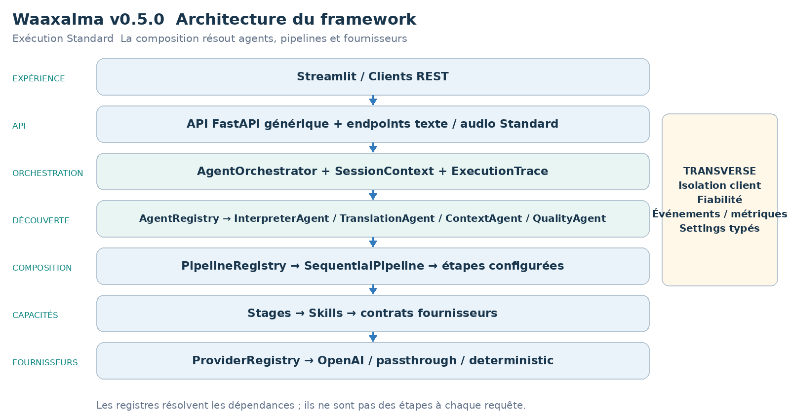
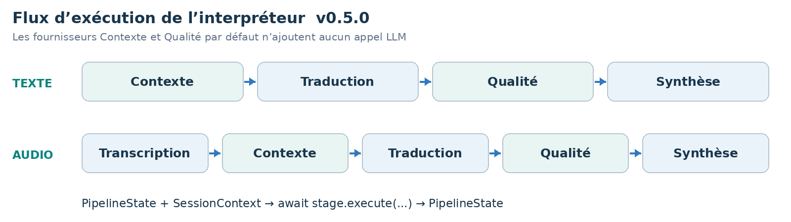
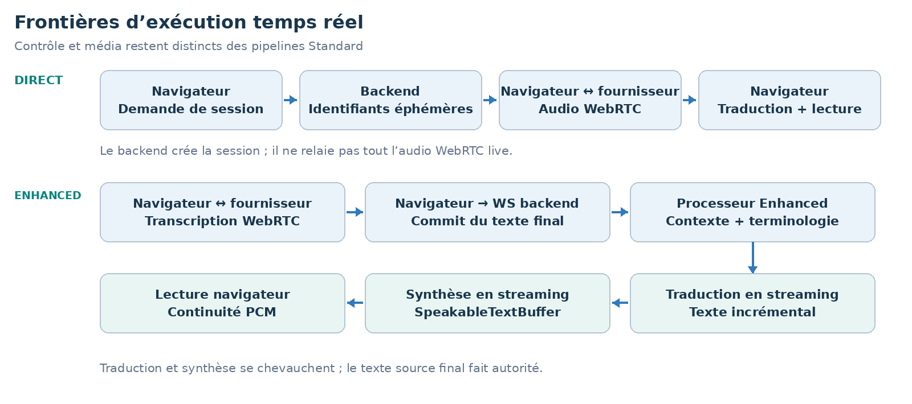
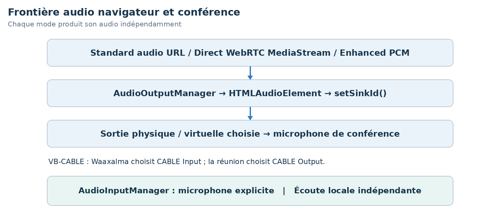

LIVRE D’ARCHITECTURE ET DE VISION  ·  v0.5.0  ·  ÉDITION FRANÇAISE

# Waaxalma Architecture and Vision Book v0.5.0 FR

Préparation à la production

3 octobre 2026  ·  Préparation à la production

**VISION** Waaxalma (« parle pour moi ») transforme la parole, notamment en wolof, en traduction compréhensible et en audio naturel. Le produit vise à préserver l’intention ; le framework sépare agents, pipelines et capacités fournisseurs remplaçables.

## 1. Vision et périmètre

Cette édition décrit le jalon v0.5.0. Elle reprend le gabarit v0.4 et les capacités livrées à cette étape ; les jalons ultérieurs restent des évolutions futures dans cette édition historique.

- Six slices livrent sessions persistantes, isolation client, configuration typée, packaging, CI, observabilité métier et gouvernance opérationnelle.
- La source historique décrit une candidate en attente d’acceptation finale. Ces éditions conservent ce statut sans annoncer rétrospectivement un nouveau benchmark ni un audit de sécurité indépendant.

### 2. Fondations construites

| Couche | Implémentation | Rôle |
| --- | --- | --- |
| API | FastAPI | Exécution générique d’agents enregistrés ; routes texte/voix. |
| Orchestration | AgentOrchestrator | Résultats, erreurs, durée et annulation. |
| Découverte | AgentRegistry / ProviderRegistry | Résolution explicite par nom et capacité. |
| Composition | PipelineRegistry / SequentialPipeline | Étapes réutilisables ordonnées. |
| Temps réel | Direct / Enhanced | Chemins de sessions et capacités live dédiés. |
| Périphériques audio | Input / Output / Local Monitor | Intégration périphérique côté navigateur. |
| Production | SQLite / settings / wheel / CI | État, isolation et gouvernance opérationnelle. |

### 3. Principes directeurs

- Étendre par contrats, enregistrement et composition ; détecter tôt fournisseurs/pipelines inconnus.
- Les Skills dépendent de contrats de capacité. Fiabilité et observabilité restent transverses. Contexte/Qualité par défaut n’ajoutent aucun appel LLM.
- Séparer traitements Standard, transports temps réel et périphériques navigateur ; expliciter les limites de validation.

## 4. Architecture actuelle

La racine de composition assemble fournisseurs concrets, Skills, étapes, pipelines et agents. Les registres résolvent les dépendances sans ajouter d’étapes de traitement à chaque requête.

Les conversations durables relèvent de SessionService/repositories. SessionContext reste un contexte d’exécution transitoire, pas une conversation persistante ni une preuve de propriété.

### 5. Flux d’exécution de l’interpréteur

**CONTRAT DU PIPELINE** Chaque étape reçoit PipelineState et SessionContext et retourne l’état mis à jour. SequentialPipeline attend les étapes dans l’ordre ; les workflows configurés évoluent sans réécrire InterpreterAgent.

## 6. Modèle d’extensibilité du framework

L’extension repose sur enregistrement et composition explicites, avec API générique et cœur d’orchestration préservés. Les adaptateurs fournisseurs changent derrière les contrats de capacité.

| Extension | Changement requis | Frontière préservée |
| --- | --- | --- |
| Nouvel agent | BaseAgent + AgentRegistry | API / AgentOrchestrator |
| Nouveau fournisseur | Implémenter le contrat de capacité ; enregistrer capacité + nom. | Skill / Agent / API |
| Nouveau pipeline | Composer les étapes et enregistrer le nom. | SequentialPipeline |
| Nouvelle étape | PipelineStage | InterpreterAgent / API |
| Stratégie contexte/qualité | ContextProvider / QualityProvider | Structure des étapes configurées. |

RealtimeTranslationProvider est résolu par capacité et nom sans faire passer les sessions live par SequentialPipeline.

StreamingTranscriptionProvider, StreamingTranslationProvider et StreamingSpeechProvider isolent les adaptateurs Enhanced de l’orchestration et de la lecture.

### 7. Contexte et Qualité comme capacités à part entière

- PassthroughContextProvider préserve texte source/métadonnées. TranslationStage privilégie enriched_text lorsqu’il est fourni et conserve source_text.
- DeterministicQualityProvider évalue la structure, pas la justesse sémantique. accepted, score, issues et métadonnées qualité sont retournés ; le rejet ne crée pas de blocage implicite.

- Direct contourne Contexte/Qualité Standard pour préserver son chemin de latence natif.

- Enhanced utilise terminologie et trois segments source finaux antérieurs comme référence ; il n’ajoute pas d’évaluateur sémantique supplémentaire.

### Architecture et exécution temps réel

Direct crée une session fournisseur éphémère via le backend. Le navigateur négocie ensuite SDP et WebRTC et reçoit texte/audio traduits. Création de session et échange média navigateur/fournisseur sont distincts.

Enhanced crée une session de transcription éphémère, commit le texte final sur /api/realtime/enhanced/stream et compose traduction/TTS en streaming. Les adaptateurs par défaut utilisent gpt-live-transcribe, gpt-4.1-mini et gpt-4o-mini-tts ; ces noms décrivent la configuration historique, pas une nouvelle garantie de disponibilité.

| Responsabilité | Frontière d’exécution |
| --- | --- |
| Création de session | Le backend obtient un secret fournisseur éphémère. |
| Média Direct | Navigateur et fournisseur échangent le média WebRTC. |
| Orchestration Enhanced | Transcription finale → traduction en streaming → TTS. |

### Mesures temps réel et traitement des transcriptions

### Mesures historiques Direct

| Signal | Valeur observée |
| --- | --- |
| Demande de session | ~1.61 s |
| Acquisition microphone | ~0.47 s |
| Établissement WebRTC | ~1.84 s |
| Parole → premier texte traduit | ~0.39 s |
| Parole → premier audio traduit | ~1.35 s |
| Texte traduit → audio | ~0.96 s |

### Échantillon historique Enhanced à chaud

| Métrique | p50 | p95 |
| --- | --- | --- |
| Commit → traduction | ~0.55 s | ~0.75 s |
| Traduction → audio | ~0.60 s | ~0.81 s |
| Commit → audio | ~1.17 s | ~1.46 s |
| Début TTS → audio | ~0.51 s | ~0.69 s |

Il s’agit d’observations locales historiques : Enhanced utilisait dix segments à chaud. Démarrage, reconnaissance, traduction et audio sont mesurés séparément. Ce ne sont ni des SLA ni de nouveaux benchmarks.

### Contrat de transcription finale et de contexte

- Terminologie et trois derniers segments source finaux servent uniquement de contexte de référence ; ils ne sont pas retraduits. Langue source, prompt STT et mots-clés sont configurables.
- SpeakableTextBuffer fait chevaucher traduction et TTS. Continuité PCM16 entre octets et jitter buffer de 20 ms préservent la lecture. Le navigateur commit après environ 320 ms de silence détecté par RMS.

### Sortie audio et conférence

- AudioInputManager sélectionne un microphone physique explicite via audioInputDeviceId conservé. Direct et Enhanced ne dépendent plus de l’entrée Windows par défaut.
- La sortie conférence reste partagée par Standard, Direct et Enhanced. monitorOutputDeviceId et monitorEnabled choisissent une écoute casque séparée sans « Écouter ce périphérique » Windows.
- Le workspace Streamlit large regroupe Microphone, Conference Output, Local Monitor et Conference Input. Les pilotes virtuels restent des prérequis externes documentés dans tools/README.md.
- Le chemin de release pris en charge est la sortie vers Teams/Meet/Zoom via périphériques navigateur et câble virtuel. Edge conserve la validation Teams réelle.

ConferenceInputManager, inbound STT/traduction/TTS et coordination Full Duplex restent expérimentaux. La validation complète nécessite un second chemin virtuel indépendant ; connexion aux réunions et appels Graph ne bloquent pas cette release.

| Mode | Pont audio |
| --- | --- |
| Standard | URL audio → élément HTML audio géré. |
| Direct | MediaStream WebRTC traduit → lecture gérée. |
| Enhanced | Web Audio → destination MediaStream → lecture gérée. |
| Conférence | CABLE Input → VB-CABLE → microphone CABLE Output de la réunion. |

## 8. Héritage de fiabilité et d’observabilité

- Les politiques retry/timeout restent centralisées lorsqu’elles sont compatibles. AgentOrchestrator normalise les erreurs et préserve l’annulation.
- ExecutionTrace décrit durées d’étape/fournisseur, résultat et erreurs. Prometheus couvre exécutions, durées et retries.

La création realtime utilise erreurs normalisées et métriques fournisseur/modèle/résultat. La QoE navigateur rapporte des latences bornées sans labels request_id, session_id ni client_secret. Stop libère les ressources ; une reconnexion utilise un nouveau secret.

Les métriques par énoncé séparent reconnaissance, traduction et audio. Les détails backend passent en DEBUG ; la déconnexion WebSocket arrête la sortie sans erreur secondaire d’envoi.

### Identité et sessions durables

X-Client-Id est ASCII strict et sensible à la casse ; il reste déclaratif, pas une authentification OAuth/OIDC/JWT. La création persiste owner_id immuable. GET/PATCH/close et interprétation liée contrôlent propriétaire/cycle de vie. Identité absente/invalide : 401 ; autre propriétaire : 403 ; session persistante absente : 404 ; opération active sur session fermée : 409.

Le stockage historique schéma 0/1 migre de façon idempotente vers le schéma 2 avec owner_id nullable ; attribution hors ligne explicite pour les lignes sans propriétaire. Les connexions SQLite ferment à chaque opération, même en erreur. Health/métriques/docs/audio statique restent des surfaces non authentifiées ; les URL opaques ne sont pas un contrôle d’accès.

### Événements et télémétrie de production

Les événements corrèlent request_id, session_id, execution_mode, fournisseur/modèle, langues, latence, statut et type d’erreur sûr. Les logs excluent textes, traductions, audio, prompts, secrets et contenu brut des exceptions. X-Request-Id sert à corréler, pas à nommer un fichier ni à garantir l’idempotence. Les nouvelles métriques évitent labels identifiants/langues.

Les métriques exposent sessions persistantes actives, durée, nettoyage, durées/erreurs fournisseur et tokens disponibles. Les comptages survivent via lecture repository ; les compteurs repartent à zéro et ne sont pas des factures. Stockage absent : scrape_error sans recréation. Coût : deux directions de tokens et tarifs explicites, hors dimensions audio/cache/facturation inconnues.

Les spans OpenTelemetry privés optionnels utilisent un collecteur OTLP/HTTP opérateur, un ratio racine de 1.0 par défaut et respectent les parents. Pas d’auto-instrumentation SDK sortante ni de stack de monitoring intégrée implicite.

### Configuration packaging et cycle de vie

Les settings typés séparent development/test/production. Seul development lit le .env local ; production exige clé fournisseur explicite non vide et stockage persistant. Backend/UI ont des locks universels hachés distincts. Le wheel Python 3.12 expose waaxalma-backend ; conteneurs épinglés par digest, UID/GID 10001, racine en lecture seule et montages inscriptibles explicites. Profil : un worker backend.

/health/live vérifie la réponse du processus ; /health/ready vérifie démarrage et stockage local/session. Aucun ne garantit disponibilité fournisseur. Les images par défaut omettent le SDK OTel optionnel ; lock/build distinct. Déploiement cloud et stockage distribué restent des choix indépendants.

Propriétaire, statut, langues, horodatages, métadonnées et messages ordonnés survivent au redémarrage. Connexions live, contexte glissant, audio et tâches en cours non. Pas de file de jobs durable ni livraison exactly-once ; une mutation validée peut survivre à une réponse perdue.

La rétention des sessions fermées est optionnelle, défaut configurable 30 jours ; lignes actives/sans horodatage exclues. Dry-run rapporte les comptes. Rétention audio/fichiers, backups/logs et expiration active distinctes. Uvicorn : drainage de 15 secondes ; Docker : grâce de 30 secondes. Lifespan arrête maintenance et flush la télémétrie, mais asyncio ne force pas l’arrêt des threads SDK synchrones.

### CI et gouvernance

La CI vérifie syntaxe, installations/régressions Windows/Linux distinctes, rendu UI, tracing optionnel, wheel hors sources, conteneurs non-root, smoke health/propriété et continuité après arrêt propre. Artefacts : wheel/images et SHA256. L’hygiène ciblée des secrets ne remplace ni revue humaine ni audit indépendant. Tag après CI du commit exact et acceptation audio réelle ; pas de cloud ni d’upload registre automatique.

## 9. Roadmap technique

Chaque jalon s’appuie sur l’architecture précédente. Le tableau décrit les capacités livrées, sans attester un tag public non vérifié. Le périmètre futur est conservé selon le jalon historique.

| Jalon | Position dans cette édition |
| --- | --- |
| Prototype et orchestration | Fondation |
| Fiabilité | Fondation |
| Framework Next | Fondation |
| Realtime Direct | Fondation |
| Realtime Enhanced | Fondation |
| Sortie audio universelle | Fondation |
| Contrôle des périphériques | Fondation |
| Product Readiness | Candidate historique |
| Framework stable | Futur à cette version |

### 10. Carte des releases Git

| Version | Jalon |
| --- | --- |
| v0.1.0 | Prototype |
| v0.2.0 | Orchestration agents |
| v0.3.0 | Fiabilité |
| v0.4.0 | Framework Next |
| v0.4.1 | Traduction temps réel et configuration de voix |
| v0.4.2 | Streaming Realtime Enhanced |
| v0.4.3 | Sortie audio universelle et pont de conférence |
| v0.4.4 | Audio de conférence et contrôle des périphériques |
| v0.5.0 | Préparation à la production |
| v1.0.0 | Framework stable |

## 11. Critères d’achèvement v0.5.0

- Six slices livrent sessions persistantes, isolation client, configuration typée, packaging, CI, observabilité métier et gouvernance opérationnelle.
- La source historique décrit une candidate en attente d’acceptation finale. Ces éditions conservent ce statut sans annoncer rétrospectivement un nouveau benchmark ni un audit de sécurité indépendant.

- Agents Standard, sélection des fournisseurs et pipelines configurés préservent les frontières v0.4 et métadonnées Contexte/Qualité.

- Les sessions live restent indépendantes de l’orchestration Standard ; fermeture sur arrêt/erreur et erreurs normalisées restent observables.

- Persistance/propriété, rétention, packaging et redémarrage passent leurs contrôles ; limites d’identité et secrets sont revus avant exposition.

**PREUVES DE VALIDATION** Régression locale historique Slice 6 : 344 réussis et 4 skips sans SDK OTel optionnel, ou 348 réussis avec SDK ; un warning Starlette existant. Wheel propre, health/propriété et restart natif consignés. Acceptation finale Windows/Linux/conteneur/navigateur encore requise dans cette source.

### 12. Prochaine étape recommandée

Le framework stable doit définir compatibilité, conformité d’extensions, transports stables et comportement runtime/migration testé. Authentification intégrée, audio protégé, fournisseurs supplémentaires et état distribué restent des travaux futurs distincts.

**PRINCIPE DU FRAMEWORK** Ajouter une capacité par enregistrement et composition sans déplacer les détails fournisseur ou conférence dans l’API/orchestration générique.
