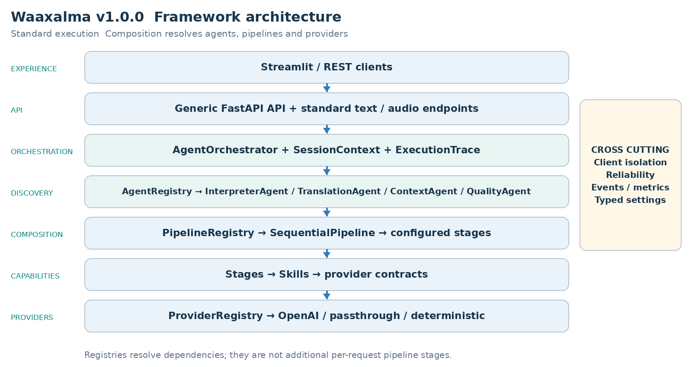
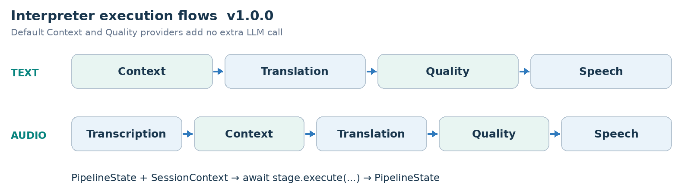
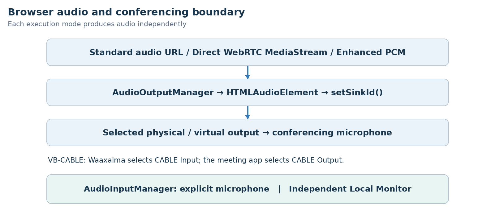

ARCHITECTURE & VISION BOOK  ·  v1.0.0  ·  ENGLISH EDITION

# Waaxalma Architecture and Vision Book v1.0.0 EN

Stable Framework Release

3 October 2026  ·  Stable Framework Release

**VISION** Waaxalma (“speak for me”) turns speech, particularly in Wolof, into understandable translated text and natural audio. The product seeks to preserve intent; the framework separates replaceable agents, pipelines and provider capabilities.

## 1. Vision and scope

This edition records the v1.0.0 milestone. It retains the architecture template from v0.4 and the capabilities delivered at this point; later milestones remain future work in this historical edition.

- v1.0.0 consolidates the product-ready baseline and formalizes stable public imports, extension conformance, reviewed HTTP/WebSocket schemas and a supported runtime/upgrade profile.
- All five framework slices were integrated and accepted by the maintainer. Version metadata, health/OpenAPI, wheel and image names align to 1.0.0; publication remains the maintainer’s verified-commit action.

### 2. Foundation now built

| Layer | Implementation | Meaning |
| --- | --- | --- |
| API | FastAPI | Generic registered-agent execution; text/voice routes. |
| Orchestration | AgentOrchestrator | Results, errors, timing and cancellation. |
| Discovery | AgentRegistry / ProviderRegistry | Explicit resolution by name and capability. |
| Composition | PipelineRegistry / SequentialPipeline | Ordered reusable stages. |
| Realtime | Direct / Enhanced | Dedicated session and live capability paths. |
| Audio devices | Input / Output / Local Monitor | Browser-side device integration. |
| Production | SQLite / settings / wheel / CI | State, isolation and operational governance. |

### 3. Guiding principles

- Extend through contracts, registration and composition; fail early for unknown providers/pipelines.
- Skills depend on capability contracts. Reliability and observability stay cross-cutting. Context/Quality defaults add no extra LLM call.
- Separate standard workflows, realtime transports and browser devices; describe validation limits explicitly.

## 4. Current architecture

The composition root assembles concrete providers, Skills, stages, pipelines and agents. Registries resolve dependencies rather than adding processing stages to every request.

Durable conversation records belong to SessionService/repositories. SessionContext remains a transient execution context, not a persisted conversation or ownership proof.

### 5. Interpreter execution flows

**PIPELINE CONTRACT** Each stage receives PipelineState and SessionContext and returns updated state. SequentialPipeline awaits stages in order; configured workflows can evolve without rewriting InterpreterAgent.

## 6. Framework extensibility model

Extension happens through explicit registration and composition, preserving the generic API and orchestration core. Provider adapters can change behind capability contracts.

| Extension | Required change | Boundary preserved |
| --- | --- | --- |
| New agent | BaseAgent + AgentRegistry | API / AgentOrchestrator |
| New provider | Implement capability contract; register capability + name. | Skill / Agent / API |
| New pipeline | Compose stages and register its name. | SequentialPipeline |
| New stage | PipelineStage | InterpreterAgent / API |
| Context/quality strategy | ContextProvider / QualityProvider | Configured stage structure. |

RealtimeTranslationProvider is resolved by capability and name without routing live sessions through SequentialPipeline.

StreamingTranscriptionProvider, StreamingTranslationProvider and StreamingSpeechProvider isolate Enhanced adapters from processor orchestration and playback.

**STABLE SURFACE** app.framework re-exports 24 original objects with class identity preserved; imports do not require an API key or application startup. Internal bootstrap, concrete Skills and persistence repositories are outside this stable export guarantee.

app.framework.testing provides opt-in, pytest-independent conformance checks for sample results, async conventions and stream cleanup. External examples run against the installed wheel outside the source tree. ContextProvider/QualityProvider remain internal extension points rather than new facade exports.

### 7. Context and Quality as first class capabilities

- PassthroughContextProvider preserves source text/metadata. TranslationStage prefers enriched_text when supplied and preserves source_text.
- DeterministicQualityProvider evaluates structure, not semantic translation correctness. accepted, score, issues and quality metadata are returned; rejection does not create an implicit blocking policy.

- Direct bypasses standard Context/Quality to keep its provider-native latency path.

- Enhanced uses terminology and three prior final source segments as reference-only context; it does not add an extra semantic quality evaluator.

### Realtime architecture and execution

Direct creates a short-lived provider session through the backend. The browser then negotiates SDP and WebRTC and receives live translated text/audio. Session creation and browser/provider media exchange are distinct responsibilities.

Enhanced creates an ephemeral transcription session, commits final text over /api/realtime/enhanced/stream, and composes streaming translation and TTS. The default adapters use gpt-live-transcribe, gpt-4.1-mini and gpt-4o-mini-tts; these names record the historical configuration, not a new provider availability guarantee.

| Responsibility | Execution boundary |
| --- | --- |
| Session setup | Backend issues an ephemeral provider credential. |
| Direct media | Browser and provider exchange WebRTC media. |
| Enhanced orchestration | Final transcript → streaming translation → TTS. |

### Realtime measurements and transcript handling

### Direct historical measured baseline

| Signal | Observed value |
| --- | --- |
| Session request | ~1.61 s |
| Microphone acquisition | ~0.47 s |
| WebRTC establishment | ~1.84 s |
| Speech → first translated text | ~0.39 s |
| Speech → first translated audio | ~1.35 s |
| Translated text → audio | ~0.96 s |

### Enhanced historical warm path sample

| Metric | p50 | p95 |
| --- | --- | --- |
| Commit → translation | ~0.55 s | ~0.75 s |
| Translation → audio | ~0.60 s | ~0.81 s |
| Commit → audio | ~1.17 s | ~1.46 s |
| TTS start → audio | ~0.51 s | ~0.69 s |

These are historical local observations: Enhanced used a ten-segment warm-path sample. Startup, recognition, translation and audio latency are separate measurements. They are not SLAs or newly rerun benchmarks.

### Final transcript and context contract

- Terminology and the previous three final source segments are reference-only context. They are not translated again. Source language, STT prompt and keywords are configurable.
- SpeakableTextBuffer overlaps translation and TTS. PCM16 carry-byte continuity and a 20 ms jitter buffer preserve playback. The browser commits after an approximately 320 ms RMS silence window.

### Audio output and conferencing

- AudioInputManager selects an explicit physical microphone using persisted audioInputDeviceId. Direct and Enhanced stop relying on the Windows default input.
- Conference output remains shared across Standard, Direct and Enhanced. monitorOutputDeviceId and monitorEnabled select a separate local headphone sink without Windows “Listen to this device”.
- The wide Streamlit workspace consolidates Microphone, Conference Output, Local Monitor and Conference Input controls. Virtual drivers remain external prerequisites, documented under tools/README.md.
- The supported release path is outbound audio to Teams/Meet/Zoom through browser devices and a virtual cable. Edge retains the real Teams outbound validation.

ConferenceInputManager, inbound STT/translation/TTS and Full Duplex coordination remain experimental. Full end-to-end validation needs a second independent virtual path; native meeting joining and Graph calling are not release blockers.

| Mode | Audio bridge |
| --- | --- |
| Standard | Audio URL → managed HTML audio element. |
| Direct | WebRTC translated MediaStream → managed playback. |
| Enhanced | Web Audio → MediaStream destination → managed playback. |
| Conferencing | CABLE Input → VB-CABLE → CABLE Output meeting microphone. |

## 8. Reliability and observability inheritance

- Provider retry/timeout policies remain centralized where supported. AgentOrchestrator normalizes failures and preserves cancellation.
- ExecutionTrace records stage/provider duration, outcome and error information. Prometheus covers executions, stage timing and retries.

Realtime session creation uses normalized errors and provider/model/outcome metrics. Browser QoE reports bounded latency signals without request_id, session_id or client_secret metric labels. Stop releases live resources; reconnect uses a new ephemeral secret.

Per-utterance metrics separate recognition, translation and audio. Detailed backend timings move to DEBUG; WebSocket disconnects terminate output without secondary send failures.

### Identity and durable sessions

X-Client-Id is strict ASCII and case-sensitive; it remains self-declared identity, not OAuth/OIDC/JWT authentication. Creation persists immutable owner_id. GET/PATCH/close and interpretation referencing a stored session enforce owner/lifecycle. Missing or invalid identity returns 401, foreign owner 403, missing persisted session 404 and active-only operations on closed sessions 409.

Legacy schema-0/1 storage migrates idempotently to schema 2 with nullable owner_id; unowned records require deliberate offline assignment. SQLite connections close per operation, including errors. Health/metrics/docs/static audio remain separate unauthenticated surfaces; opaque audio URLs are not access control.

### Production events and telemetry

Events correlate request_id, session_id, execution_mode, provider/model, languages, latency, status and safe error type. Logs exclude text, translations, audio, prompts, credentials and raw exception content. X-Request-Id is correlation, not a filename or idempotency key. New metrics avoid identifier/language labels.

Metrics expose persisted active sessions, lifetime, cleanup, provider durations/errors and available token usage. Session counts survive restart via repository reads; counters reset and are not billing records. Missing storage marks scrape_error without recreating it. Costs require both token directions and explicit rates and omit unknown audio/cache/billing dimensions.

Optional private OpenTelemetry spans use an operator OTLP/HTTP collector, a default root sample ratio of 1.0 and respected parent sampling. No outbound SDK auto-instrumentation or bundled monitoring stack is implied.

### Configuration packaging and lifecycle

Typed settings separate development/test/production. Only development reads its local .env; production requires an explicit nonblank provider key and persistent storage. Backend/UI have separate universal hashed locks. The Python 3.12 wheel exposes waaxalma-backend; digest-pinned containers run as UID/GID 10001, with read-only root and explicit writable mounts. One backend worker is the packaging profile.

/health/live checks process response; /health/ready checks startup and local/session storage. Neither guarantees provider availability. Default images omit the optional OTel SDK; its lock/build option is separate. Cloud deployment and distributed storage are independent choices.

Owner, status, languages, timestamps, metadata and ordered messages survive restart. Live connections, rolling context, in-flight audio and tasks do not. There is no durable job queue or exactly-once delivery; committed mutations can outlive lost responses.

Closed-session retention is opt-in with a configurable 30-day default; active and missing-timestamp records are excluded. Dry-run reports counts. Audio/file, backup/log retention and active-session expiry need their own policies. Uvicorn defaults to 15-second draining; Docker gives 30 seconds stop grace. Lifespan stops maintenance and flushes optional telemetry, but asyncio cannot forcibly cancel synchronous SDK threads.

### CI and governance

CI checks syntax, separate Windows/Linux installs/regressions, UI rendering, optional tracing, the wheel outside source, non-root containers, health/ownership smoke and clean restart continuity. Artifacts include wheel/images and SHA256 checksums. Targeted secret hygiene does not replace human review or an independent audit. The final tag follows exact-commit CI and real browser/audio acceptance; no cloud deployment or registry upload is automatic.

### Stable transport runtime and upgrade guarantees

Reviewed HTTP and Enhanced WebSocket snapshots form the wire contract. HTTP uses safe code/message envelopes; Enhanced separates receive monitoring from processing, bounds queues, recovers from invalid events and closes streams on disconnect/cancellation. Snapshots normalize only the release version.

Supported profile: CPython 3.12 Linux/Windows x64, Linux amd64 images, one backend worker and Node 22 CI validation. Upgrade from v0.5 preserves schema 2, owners and ordered history. Future schemas are refused before changes. waaxalma-session-database inspects read-only and creates exclusive WAL-consistent backups. Keep configuration, full volume and previous artifacts for rollback. Native macOS/ARM64, other Python minors and multi-worker/replica operation remain outside the validated profile.

**COMPATIBILITY** Patch releases preserve documented calls; minors can add optional features; incompatible public changes require a major. Deprecations name replacements and removal versions, with at least one minor transition before a later-major removal.

## 9. Technical roadmap

Each milestone builds on the preceding architecture. The table records capability delivery, not an assertion that an unseen public Git tag exists. Future scope is preserved from the historical milestone.

| Milestone | Position in this edition |
| --- | --- |
| Prototype and orchestration | Foundation |
| Reliability | Foundation |
| Framework Next | Foundation |
| Realtime Direct | Foundation |
| Realtime Enhanced | Foundation |
| Universal Audio Output | Foundation |
| Device Control | Foundation |
| Product Readiness | Foundation |
| Stable Framework | Milestone documented |

### 10. Git release map

| Version | Milestone |
| --- | --- |
| v0.1.0 | Prototype |
| v0.2.0 | Agent Orchestration |
| v0.3.0 | Reliability |
| v0.4.0 | Framework Next |
| v0.4.1 | Realtime Translation and Voice Configuration |
| v0.4.2 | Realtime Enhanced Streaming |
| v0.4.3 | Universal Audio Output and Conferencing Bridge |
| v0.4.4 | Conferencing Audio and Device Control |
| v0.5.0 | Product Readiness |
| v1.0.0 | Stable Framework Release |

## 11. v1.0.0 definition of done

- v1.0.0 consolidates the product-ready baseline and formalizes stable public imports, extension conformance, reviewed HTTP/WebSocket schemas and a supported runtime/upgrade profile.
- All five framework slices were integrated and accepted by the maintainer. Version metadata, health/OpenAPI, wheel and image names align to 1.0.0; publication remains the maintainer’s verified-commit action.

- Standard agents, provider selection and configured pipelines preserve the v0.4 extension boundaries and Context/Quality metadata.

- Dedicated live sessions remain independent from standard orchestration; stop/error cleanup and normalized failures stay observable.

- Persistence/ownership, retention, packaging and restart behavior pass their dedicated gates; identity limitations and production secrets are reviewed before exposure.

**VALIDATION RECORD** Accepted stable baseline: 472 passed, four optional OTel SDK skips and one existing Starlette warning in the local default environment. Wheel installation outside source and version/schema gates passed; final acceptance was confirmed by the maintainer. These are historical records, not newly executed tests for this documentation alignment.

### 12. Recommended next slice

Next work needs an explicit objective and evidence: authenticated ingress, protected audio, more providers, retention policy or dedicated inbound/full-duplex validation. Native macOS/ARM64 and multi-worker operation require their own acceptance.

**FRAMEWORK PRINCIPLE** Add a capability through registration and composition without moving provider-specific or conferencing concerns into generic API/orchestration.
