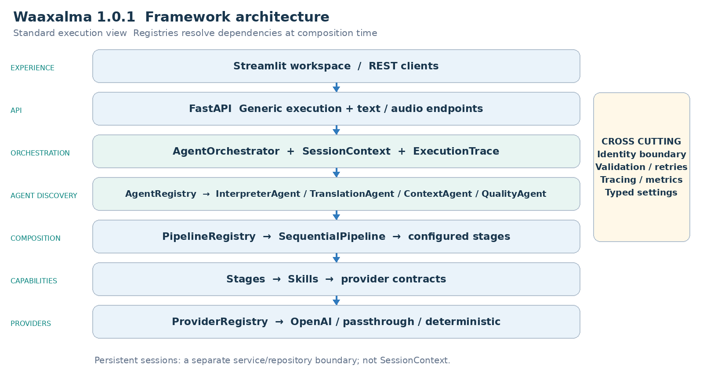
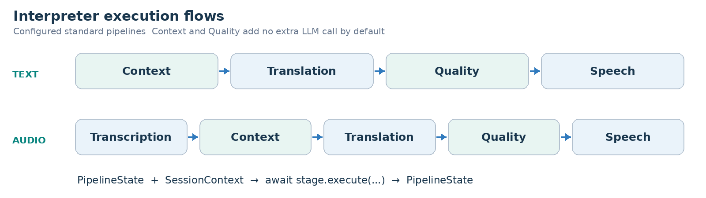
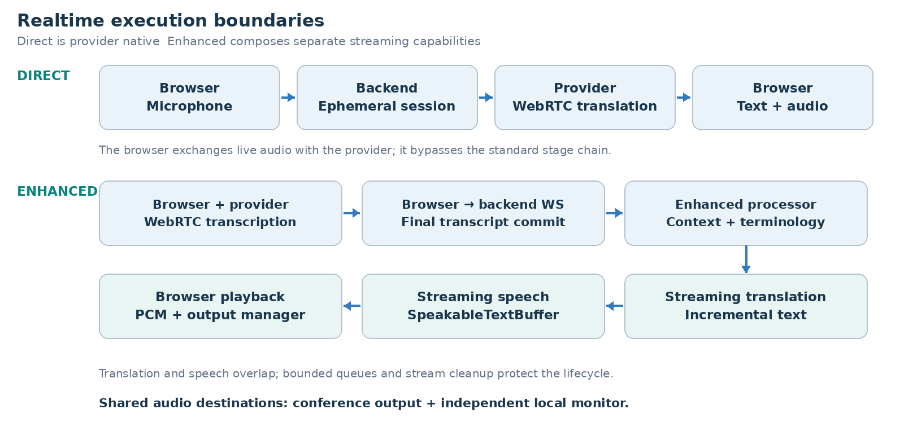

ARCHITECTURE & VISION BOOK  ·  v1.0.1  ·  ENGLISH EDITION

# Waaxalma Architecture and Vision Book v1.0.1 EN

From an extensible voice pipeline to a stable and governable framework

3 October 2026  ·  Stable Framework baseline v1.0.0  ·  Documentation patch v1.0.1

**VISION** Waaxalma means “speak for me”: capture speech, preserve intent and return understandable translated text and natural audio, particularly for multilingual communication involving Wolof. This edition consolidates the validated framework and production foundations; the patch restores the architecture-book structure without introducing runtime behavior.

## 1. Vision and scope

The product boundary is multilingual interpretation. The framework boundary is an explicit set of agents, pipelines and provider contracts that can evolve independently. Standard, Realtime Direct and Realtime Enhanced retain distinct execution paths while sharing browser audio-device control.

- Inputs: microphone audio, uploaded audio, text and live microphone streams.
- Outputs: source text when available, translated text, generated or streamed audio, session and quality metadata, and explicit playback destinations.

### 2. Foundation now built

| Layer | Delivered foundation | Architectural meaning |
| --- | --- | --- |
| Execution | AgentOrchestrator + registries | Resolve agents and compose workflows explicitly. |
| Capabilities | Stages / Skills / providers | Separate workflow logic from concrete adapters. |
| Realtime | Direct + Enhanced | Preserve distinct latency and context trade-offs. |
| State | SQLite schema 2 | Persist owner, lifecycle, metadata and ordered history. |
| Delivery | Wheel + containers + CI | Repeatable configuration, non-root execution and gates. |
| Stable API | app.framework / testing | Documented public imports and opt-in conformance. |

### 3. Guiding principles

- Extend through contracts, registration and composition; fail early for unknown configuration.
- Keep provider selection, reliability and observability outside agent-specific HTTP routing.
- State the validated runtime, identity and lifecycle boundaries; a stable version does not remove deployment constraints.

## 4. Current architecture

The composition root assembles concrete adapters, Skills, stages, pipelines and agents. Registries are resolution mechanisms, not extra processing stages on every request. This view describes standard execution; realtime services use their own explicit provider contracts.

Reading: HTTP routing delegates execution to AgentOrchestrator. InterpreterAgent receives the configured text/audio pipelines. SessionService and the SQLite repository manage durable conversations independently from transient SessionContext.

### 5. Interpreter execution flows

**PIPELINE CONTRACT** Each stage receives PipelineState and SessionContext, then returns the updated state. SequentialPipeline awaits stages in order. Exceptions and cancellation propagate; pipeline execution does not add a separate retry layer.

### Realtime execution flows

Direct creates a short-lived translation session through the backend, then the browser negotiates WebRTC with the provider. Enhanced creates a streaming transcription session, commits the authoritative final transcript over the backend WebSocket, and coordinates streaming translation and speech.

| Mode | Backend boundary | Execution responsibility |
| --- | --- | --- |
| Standard | /api/text/interpret · /api/voice/interpret | Text/audio pipeline, context, translation, quality and speech. |
| Direct | /api/realtime/translation/session | Create ephemeral credentials; live provider exchange is browser-side. |
| Enhanced | /api/realtime/enhanced/session · /stream | Streaming STT session plus final commits, context, translation/TTS and cleanup. |

### Audio devices and conferencing

AudioInputManager selects capture devices; AudioOutputManager routes each mode to the primary/conference output and an independent local monitor when supported by the browser. A virtual audio cable connects that output to the meeting application microphone. Inbound and Full Duplex remain experimental; the supported integration is outbound audio, not automatic meeting joining or a native Teams SDK.

## 6. Framework extensibility model

The v0.4 principle remains: add capabilities without changing generic routing or the orchestration core. v1.0 formalizes 24 public re-exports in app.framework, preserving the identity of the original classes. Importing the facade requires neither an API key nor application startup.

| Extension | Required change | Preserved boundary |
| --- | --- | --- |
| New agent | BaseAgent + AgentRegistry | Generic API / AgentOrchestrator |
| New provider | Implement the capability protocol; register capability + name. | Skill / Agent / API |
| New pipeline | Compose stages; register the named pipeline. | SequentialPipeline |
| New stage | Implement PipelineStage; include it in a configured pipeline. | InterpreterAgent / API |
| New live adapter | Implement the corresponding realtime or streaming protocol. | Service/processor and documented wire contract. |
| Context/quality strategy | Replace the internal provider through composition. | Pipeline structure; subject to internal contract review. |

**PUBLIC SURFACE** The stable facade covers agents, tracing, pipelines, registries, standard/live provider protocols and live value models. ContextProvider, QualityProvider, concrete Skills, bootstrap internals and third-party persistence repositories are not exported as stable extension contracts.

app.framework.testing provides opt-in, pytest-independent conformance checks. Samples verify async/iterator conventions, result types and cleanup, including stream closure on errors or cancellation. They do not certify provider accuracy. CI runs an external example against the installed wheel outside the checkout.

### 7. Context and Quality as first class capabilities

- Standard: PassthroughContextProvider preserves source text and metadata; TranslationStage prefers enriched_text when present.
- DeterministicQualityProvider performs structural checks. Its accepted/score/issues metadata is observable; rejection does not create an implicit blocking policy.
- Direct bypasses the standard Context/Quality chain. Enhanced uses terminology and the previous three final source segments as reference-only context, not text to translate again.

## 8. Reliability and observability inheritance

The framework retains centralized provider timeout/retry policies where supported, normalized failures and cancellation propagation. ExecutionTrace records stage duration and outcome. Direct and Enhanced remain separately observable; earlier v0.4.x latency samples are historical measurements, not new v1.0.1 benchmarks or SLAs.

### HTTP and streaming stability

- Reviewed OpenAPI and Enhanced WebSocket snapshots are checked on Linux and Windows; only the release version is normalized in the OpenAPI snapshot.
- HTTP failures expose structured code/message envelopes. Unexpected errors are sanitized. Generic agent success output remains operation-specific.
- Enhanced separates receive monitoring from serial processing, bounds its queues and closes provider streams on disconnect/cancellation. Invalid recoverable events produce documented errors.

### Production observability

Business events correlate request_id, session_id, execution_mode, provider, model, source_language, target_language, latency_ms, status and error_type when known. Metrics cover HTTP/agent/stage activity, provider failures and durations, active persisted sessions, session duration and cleanup. Available provider token usage and explicitly configured rates support partial cost estimates.

**DATA BOUNDARY** Logs exclude transcripts, translations, audio, prompts, credentials and raw exception content. Metrics avoid high-cardinality client/request/session labels. OpenTelemetry uses a separate optional SDK lock and configuration; the default runtime does not depend on it.

### Persistent sessions and security

SQLite persists immutable owner_id, status, languages, mode, timestamps, metadata and ordered messages. X-Client-Id is strictly validated, but remains self-declared identity rather than authentication. Protected session access and interpretation using a persisted session enforce ownership and lifecycle. Legacy ownerless rows require deliberate offline assignment.

| Condition | Response | Meaning |
| --- | --- | --- |
| Missing/invalid identity | 401 | A valid client header is required. |
| Foreign owner | 403 | The persisted conversation belongs to another client. |
| Missing session | 404 | Strict persisted lookup cannot find the session. |
| Closed session operation | 409 | An operation requiring active state is rejected. |

### Production configuration and packaging

Typed settings distinguish development, test and production. Backend and UI use separate hashed dependency locks. Source becomes a Python wheel, then a pinned-base container image running as non-root UID/GID 10001 with a persistent writable data volume. /health/live measures process liveness; /health/ready checks startup/local storage readiness, not provider availability.

| Component | Supported profile | Evidence gate |
| --- | --- | --- |
| Backend / UI | CPython 3.12 · Linux/Windows x64 | Clean independent locks; regressions and UI render checks. |
| Containers | Linux amd64 · 1 backend worker | Wheel installation, health, UID and restart smoke. |
| Persistence | SQLite schema 2 · WAL | Frozen v0.5 fixtures, integrity, WAL backup and reopen. |
| JavaScript checks | Node 22 | Syntax/render CI; not an application runtime dependency. |

Native macOS, ARM64 images, other Python minors and multiple backend workers/replicas are outside this validated profile. Windows Docker Desktop hosts the Linux artifact; it does not imply a native Windows container image.

### Upgrade and restart guarantees

Upgrading v0.5.0 to the stable baseline keeps schema 2 and preserves stored identifiers, owners and ordered history. Initialization is idempotent and refuses future schemas before modifying them. The installed waaxalma-session-database utility inspects existing storage read-only and creates a new WAL-consistent SQLite backup without exposing conversation content.

- Persisted active conversations remain active after restart. WebRTC/WebSocket connections, pending audio and transcript buffers must be recreated.
- Closed-session cleanup is opt-in, with a configurable 30-day default. Active sessions are excluded; audio/file/log retention needs separate policies.
- Default shutdown budgets are 15 seconds for Uvicorn draining and 30 seconds for Docker stop grace. Keep volume/configuration and previous artifacts for rollback.

### Portable quality gates

Pull requests run static checks, clean Windows/Linux tests, optional telemetry tests, isolated wheel installation, container build and smoke/restart checks. Verified wheel/images receive streamed SHA256 checksums. CI artifacts have 14-day retention; publication and cloud deployment remain separate actions.

## 9. Technical roadmap

The roadmap retains the v0.4 progression and records the later delivered milestones. v1.0.1 aligns the documentation with that architecture; it does not add another execution mode or widen the stable contract.

| Stage | State | Deliverables and exit criterion |
| --- | --- | --- |
| Prototype | Validated | Text/voice translation and audio journey. |
| Orchestration | Validated | Agent contracts and one execution model. |
| Reliability | Validated | Validation, retries/timeouts, traces and observable failures. |
| Framework Next | Validated | Registries, configured pipelines, Context/Quality capabilities. |
| Realtime and devices | Validated | Direct/Enhanced, shared output, explicit input and local monitor. |
| Product Readiness | Validated | Persistent sessions, isolation, packaging, CI, telemetry, governance. |
| Stable Framework | Validated baseline | Public facade, conformance, transport snapshots, runtime/upgrade. |
| Documentation alignment | Patch prepared | Equivalent EN/FR books and restored architecture/flow diagrams. |

### 10. Git release map

| Version | Milestone | Position |
| --- | --- | --- |
| v0.1.0 / v0.2.0 / v0.3.0 | Prototype / Orchestration / Reliability | Historical foundations |
| v0.4.0 | Framework Next | Architecture template baseline |
| v0.4.1–v0.4.4 | Realtime / Audio output / Device control | Retained capabilities |
| v0.5.0 | Product Readiness | Delivered operational foundation |
| v1.0.0 | Stable Framework Release | Accepted implementation baseline |
| v1.0.1 | Bilingual architecture-book correction | Prepared documentation; tag by maintainer |

**RELEASE STATUS** Version labels identify milestones. This edition does not itself create or attest a Git tag, registry upload or public release. The maintainer releases the verified commit.

## 11. Stable framework definition of done

Acceptance concerns actual extension boundaries and operational behavior. The documentation patch must preserve those guarantees while making the architecture legible again.

- Public facade exports retain original object identity and documented async conventions; imports do not initialize application services.
- External extensions run through conformance checks and a clean installed wheel. Internal implementation modules do not become public contracts.
- Reviewed HTTP/WebSocket snapshots, safe errors, bounded queues and deterministic cancellation/cleanup are regression-tested.
- Supported runtime, schema refusal, read-only backup, ownership continuity and history preservation are explicit and tested.
- Windows/Linux quality jobs and container gates validate the release commit; real browser audio acceptance remains necessary for Standard, Direct and Enhanced.
- The EN/FR editions carry the same sections, diagrams and limitations. Documentation corrections do not promise new runtime support.

**VALIDATION BASELINE** The integrated stable implementation recorded 472 passed tests, four optional OpenTelemetry SDK skips and one known non-blocking Starlette deprecation warning in the local default environment. This is baseline evidence, not a newly executed v1.0.1 test run or a provider performance claim.

### 12. Recommended next slice

Choose the next product objective explicitly: authenticated ingress, protected audio delivery, more providers, stronger data-retention policy or dedicated inbound/full-duplex acceptance. Each needs its own threat model, contract review and runtime evidence; none is silently included by this patch.

**COMPATIBILITY** Patch releases preserve documented calls; minor releases add optional features; incompatible public changes require a major release. Deprecations identify a replacement and removal version, with at least one minor transition before later-major removal.

### Repository documentation

Implementation detail: docs/framework-contracts.md; docs/extension-conformance.md; docs/api-streaming-stability.md; docs/supported-runtime.md; docs/upgrade-v0.5-to-v1.md; docs/operations.md; docs/observability.md; SECURITY.md; ENVIRONMENT.md. The v1.0.0 release checklist remains the baseline process; patch release metadata must be aligned separately before tagging.
