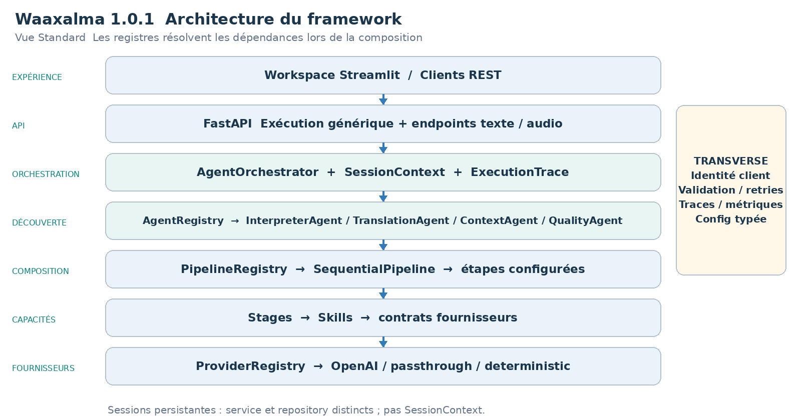
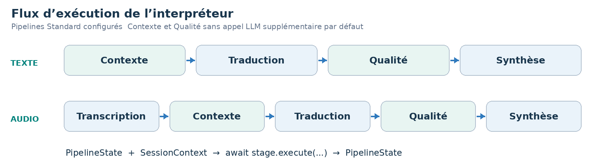
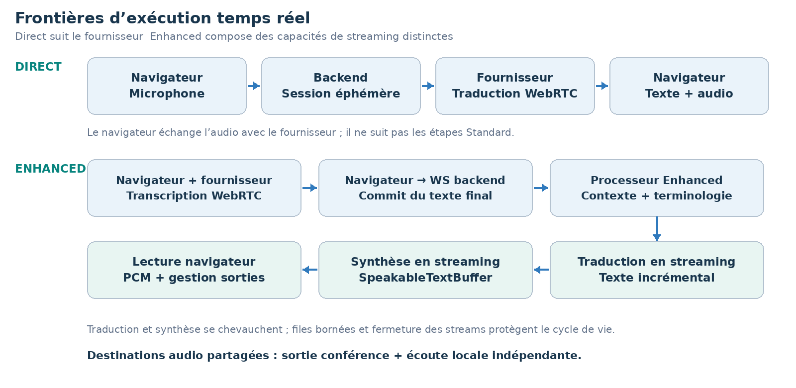

LIVRE D’ARCHITECTURE ET DE VISION  ·  v1.1.0  ·  ÉDITION FRANÇAISE

# Waaxalma Architecture and Vision Book v1.1.0 FR

Du pipeline vocal extensible au framework stable et gouvernable

7 octobre 2026  ·  Socle Stable Framework v1.0.0  ·  Release Text Translation v1.1.0

**VISION** Waaxalma signifie « parle pour moi » : capter la parole, préserver l’intention et restituer une traduction compréhensible et un audio naturel, notamment pour les échanges multilingues impliquant le wolof. Cette édition consolide le framework validé, l’observabilité Prometheus/Grafana et la capacité Text Translation de v1.1.0 tout en préservant les chemins Voice existants.

## 1. Vision et périmètre

Le périmètre produit est l’interprétation multilingue dans les workspaces Voice et Text. Le périmètre du framework est un ensemble explicite d’agents, de pipelines et de contrats fournisseurs pouvant évoluer indépendamment. Standard, Realtime Direct et Realtime Enhanced gardent des chemins d’exécution distincts et partagent la gestion des périphériques audio du navigateur.

- Entrées : microphone, fichier audio, texte et flux microphone en temps réel.
- Sorties : texte source lorsqu’il est disponible, traduction, audio généré ou diffusé, métadonnées de session et de qualité, destinations de lecture explicites.

### 2. Fondations construites

| Couche | Fondation livrée | Rôle architectural |
| --- | --- | --- |
| Exécution | AgentOrchestrator + registries | Résoudre les agents et composer les traitements explicitement. |
| Capacités | Stages / Skills / providers | Séparer la logique du traitement des adaptateurs concrets. |
| Temps réel | Direct + Enhanced | Préserver les compromis distincts de latence et de contexte. |
| État | SQLite schema 2 | Persister propriétaire, cycle de vie, métadonnées et historique ordonné. |
| Livraison | Wheel + containers + CI | Configuration répétable, exécution non-root et contrôles qualité. |
| API stable | app.framework / testing | Imports publics documentés et conformité optionnelle. |

### 3. Principes directeurs

- Étendre par contrats, enregistrement et composition ; détecter tôt les configurations inconnues.
- Garder sélection des fournisseurs, fiabilité et observabilité hors du routage HTTP propre aux agents.
- Déclarer les limites validées de runtime, d’identité et de cycle de vie ; une version stable ne supprime pas les contraintes de déploiement.


## 4. Architecture actuelle

La racine de composition assemble adaptateurs concrets, Skills, étapes, pipelines et agents. Les registres assurent la résolution ; ils ne sont pas des étapes de traitement supplémentaires à chaque requête. Cette vue décrit l’exécution Standard ; les services temps réel utilisent leurs propres contrats fournisseurs.



Lecture : le routage HTTP délègue l’exécution à AgentOrchestrator. InterpreterAgent reçoit les pipelines texte/audio configurés. SessionService et le repository SQLite gèrent les conversations durables indépendamment du SessionContext transitoire.

### 5. Flux d’exécution de l’interpréteur



**CONTRAT DU PIPELINE** Chaque étape reçoit PipelineState et SessionContext, puis retourne l’état mis à jour. SequentialPipeline attend les étapes dans l’ordre. Exceptions et annulation se propagent ; le moteur n’ajoute pas de couche de retry distincte.


### Flux d’exécution Text Translation

v1.1.0 ajoute un chemin de traduction texte dédié, sans synthèse vocale. L’API REST délègue à `TextTranslationService`, qui compose les capacités existantes Contexte, Traduction et Qualité sans invoquer le TTS.

```text
Workspace Streamlit Text
        ↓
POST /api/text/translate
        ↓
TextTranslationService
        ↓
Contexte → Traduction → Qualité
        ↓
Texte traduit
```

La langue source peut être omise ; cette omission ne signifie pas qu’une détection automatique est garantie. Le service conserve la corrélation des requêtes et le chemin d’observabilité fournisseur existant.

### Flux d’exécution temps réel

Direct crée une session de traduction éphémère via le backend, puis le navigateur négocie WebRTC avec le fournisseur. Enhanced crée une session de transcription en streaming, transmet le texte final faisant autorité sur le WebSocket backend, puis coordonne traduction et synthèse en streaming.



| Mode | Frontière backend | Responsabilité d’exécution |
| --- | --- | --- |
| Standard | /api/text/interpret · /api/voice/interpret | Pipeline texte/audio, contexte, traduction, qualité et synthèse. |
| Direct | /api/realtime/translation/session | Créer les identifiants éphémères ; échange live côté navigateur. |
| Enhanced | /api/realtime/enhanced/session · /stream | Session STT en streaming, commits finaux, contexte, traduction/TTS et fermeture. |

### Périphériques audio et conférence

AudioInputManager sélectionne la capture ; AudioOutputManager dirige chaque mode vers la sortie principale/conférence et une écoute locale indépendante lorsque le navigateur le permet. Un câble audio virtuel relie cette sortie au microphone de l’application de réunion. Inbound et Full Duplex restent expérimentaux ; l’intégration prise en charge est la sortie audio, pas la connexion automatique aux réunions ni un SDK Teams natif.


## 6. Modèle d’extensibilité du framework

Le principe v0.4 demeure : ajouter des capacités sans modifier le routage générique ni le cœur d’orchestration. v1.0 formalise 24 réexports publics dans app.framework, avec l’identité des classes originales préservée. Importer cette façade ne requiert ni clé API ni démarrage de l’application.

| Extension | Changement requis | Frontière préservée |
| --- | --- | --- |
| Nouvel agent | BaseAgent + AgentRegistry | Generic API / AgentOrchestrator |
| Nouveau fournisseur | Implémenter le protocole de capacité ; enregistrer capacité + nom. | Skill / Agent / API |
| Nouveau pipeline | Composer les étapes ; enregistrer le pipeline nommé. | SequentialPipeline |
| Nouvelle étape | Implémenter PipelineStage ; l’intégrer au pipeline configuré. | InterpreterAgent / API |
| Nouvel adaptateur live | Implémenter le protocole realtime ou streaming correspondant. | Service/processeur et contrat réseau documenté. |
| Stratégie contexte/qualité | Remplacer le fournisseur interne par composition. | Structure du pipeline ; sous réserve de revue du contrat interne. |

**SURFACE PUBLIQUE** La façade stable couvre agents, traces, pipelines, registres, protocoles fournisseurs Standard/live et modèles live. ContextProvider, QualityProvider, Skills concrets, bootstrap interne et repositories tiers ne sont pas exportés comme contrats d’extension stables.

app.framework.testing fournit des contrôles de conformité optionnels, indépendants de pytest. Les échantillons vérifient conventions async/itérateurs, types des résultats et fermeture, y compris en cas d’erreur ou d’annulation. Ils ne certifient pas la précision du fournisseur. La CI exécute un exemple externe contre le wheel installé hors du dépôt.

### 7. Contexte et Qualité comme capacités à part entière

- Standard : PassthroughContextProvider préserve texte source et métadonnées ; TranslationStage privilégie enriched_text lorsqu’il est présent.
- DeterministicQualityProvider effectue des contrôles structurels. Ses métadonnées accepted/score/issues sont observables ; un rejet ne crée pas de politique bloquante implicite.
- Direct contourne la chaîne Contexte/Qualité Standard. Enhanced utilise la terminologie et les trois derniers segments source finaux comme contexte de référence, sans les retraduire.


## 8. Héritage de fiabilité et d’observabilité

Le framework conserve les politiques centralisées de timeout/retry fournisseur lorsqu’elles sont compatibles, les erreurs normalisées et la propagation de l’annulation. ExecutionTrace enregistre durée et résultat des étapes. Direct et Enhanced restent observables séparément ; les mesures v0.4.x sont historiques, pas de nouveaux benchmarks ni des SLA v1.1.0.

### Stabilité HTTP et streaming

- Les snapshots OpenAPI et WebSocket Enhanced revus sont contrôlés sous Linux et Windows ; seule la version de release est normalisée dans OpenAPI.
- Les erreurs HTTP exposent une enveloppe structurée code/message. Les erreurs inattendues sont assainies. Le résultat générique d’un agent reste propre à l’opération.
- Enhanced sépare surveillance de réception et traitement séquentiel, borne les files et ferme les streams fournisseur sur déconnexion/annulation. Les événements invalides récupérables produisent les erreurs documentées.

### Observabilité de production

Les événements métier corrèlent request_id, session_id, execution_mode, provider, model, source_language, target_language, latency_ms, status et error_type lorsqu’ils sont connus. Les métriques couvrent HTTP/agents/étapes, erreurs et durées fournisseur, sessions persistantes actives, durée et nettoyage. Les tokens disponibles et les tarifs explicitement configurés permettent des estimations partielles de coût.

**FRONTIÈRE DES DONNÉES** Les logs excluent transcriptions, traductions, audio, prompts, identifiants secrets et contenu brut des exceptions. Les métriques évitent les labels client/requête/session à forte cardinalité. OpenTelemetry utilise un lock SDK et une configuration optionnels distincts ; le runtime par défaut n’en dépend pas.

### Sessions persistantes et sécurité

SQLite persiste owner_id immuable, statut, langues, mode, horodatages, métadonnées et messages ordonnés. X-Client-Id est strictement validé mais reste une identité déclarative, pas une authentification. L’accès protégé et l’interprétation utilisant une session persistante contrôlent propriétaire et cycle de vie. Les lignes historiques sans propriétaire nécessitent une attribution hors ligne explicite.

| Condition | Réponse | Signification |
| --- | --- | --- |
| Identité absente/invalide | 401 | Un header client valide est requis. |
| Propriétaire différent | 403 | La conversation persistante appartient à un autre client. |
| Session absente | 404 | La recherche stricte ne trouve pas la session persistante. |
| Opération sur session fermée | 409 | Une opération nécessitant un état actif est refusée. |


### Configuration et packaging de production

Les settings typés distinguent development, test et production. Backend et UI utilisent des locks de dépendances hachés distincts. Le code devient un wheel Python puis une image conteneur à base épinglée, exécutée en non-root UID/GID 10001 avec volume de données persistant et inscriptible. /health/live mesure la vie du processus ; /health/ready contrôle démarrage et stockage local, pas la disponibilité fournisseur.

| Composant | Profil pris en charge | Contrôle de validation |
| --- | --- | --- |
| Backend / UI | CPython 3.12 · Linux/Windows x64 | Locks propres et distincts ; régressions et rendu UI. |
| Conteneurs | Linux amd64 · 1 backend worker | Installation wheel, health, UID et smoke de redémarrage. |
| Persistance | SQLite schema 2 · WAL | Fixtures v0.5 figées, intégrité, backup WAL et réouverture. |
| Contrôles JavaScript | Node 22 | Syntaxe/rendu CI ; pas une dépendance du runtime applicatif. |

macOS natif, images ARM64, autres versions mineures Python et plusieurs workers/réplicas backend sont hors de ce profil validé. Docker Desktop Windows héberge l’artefact Linux ; cela n’implique pas une image Windows native.

### Garanties de mise à niveau et de redémarrage

La mise à niveau v0.5.0 vers le socle stable conserve le schéma 2, les identifiants, propriétaires et l’historique ordonné. L’initialisation est idempotente et refuse les schémas futurs avant de les modifier. L’utilitaire installé waaxalma-session-database inspecte le stockage existant en lecture seule et crée un nouveau backup SQLite cohérent avec le WAL, sans exposer le contenu des conversations.

- Les conversations persistantes actives restent actives après redémarrage. Connexions WebRTC/WebSocket, audio en attente et buffers de transcription doivent être recréés.
- Le nettoyage des sessions fermées est optionnel, avec un défaut configurable de 30 jours. Les sessions actives sont exclues ; rétention audio/fichiers/logs distincte.
- Les budgets d’arrêt par défaut sont 15 secondes pour Uvicorn et 30 secondes de grâce Docker. Conserver volume/configuration et artefacts précédents pour rollback.

### Contrôles qualité portables

Les pull requests déclenchent contrôles statiques, tests Windows/Linux en environnements propres, télémétrie optionnelle, installation isolée du wheel, build conteneur et smoke/restart. Wheel/images vérifiés reçoivent des checksums SHA256 calculés en streaming. Les artefacts CI sont conservés 14 jours ; publication et déploiement cloud restent des actions distinctes.


## 9. Roadmap technique

La roadmap conserve la progression v0.4 et consigne les jalons livrés depuis. v1.1.0 aligne la documentation avec cette architecture ; elle n’ajoute pas de mode d’exécution et n’élargit pas le contrat stable.

| Étape | État | Livrables et critère de sortie |
| --- | --- | --- |
| Prototype | Validé | Parcours traduction texte/voix et audio fonctionnel. |
| Orchestration | Validé | Contrats agents et modèle d’exécution unifié. |
| Fiabilité | Validé | Validation, retries/timeouts, traces et erreurs observables. |
| Framework Next | Validé | Registres, pipelines configurés, capacités Contexte/Qualité. |
| Temps réel et périphériques | Validé | Direct/Enhanced, sortie partagée, entrée explicite et écoute locale. |
| Product Readiness | Validé | Sessions persistantes, isolation, packaging, CI, télémétrie, gouvernance. |
| Stable Framework | Socle validé | Façade publique, conformité, snapshots réseau, runtime/migration. |
| Alignement documentaire | Correctif préparé | Livres EN/FR équivalents et schémas d’architecture/flux restaurés. |

### 10. Carte des releases Git

| Version | Jalon | Position |
| --- | --- | --- |
| v0.1.0 / v0.2.0 / v0.3.0 | Prototype / Orchestration / Fiabilité | Fondations historiques |
| v0.4.0 | Framework Next | Socle du gabarit architecture |
| v0.4.1–v0.4.4 | Temps réel / Sortie audio / Périphériques | Capacités conservées |
| v0.5.0 | Product Readiness | Fondations opérationnelles livrées |
| v1.0.0 | Stable Framework Release | Socle d’implémentation accepté |
| v1.1.0 | Correction bilingue du livre d’architecture | Documentation préparée ; tag par le mainteneur |

**STATUT DE RELEASE** Les versions identifient les jalons. Cette édition ne crée ni n’atteste elle-même un tag Git, un upload de registre ou une publication. Le mainteneur publie le commit vérifié.


## 11. Critères d’achèvement du framework stable

L’acceptation porte sur les frontières d’extension réelles et le comportement opérationnel. Le correctif documentaire doit préserver ces garanties et rendre l’architecture à nouveau lisible.

- Les exports de la façade gardent l’identité originale et les conventions async documentées ; les imports n’initialisent pas les services.
- Les extensions externes passent les contrôles de conformité et le wheel installé proprement. Les modules internes ne deviennent pas des contrats publics.
- Snapshots HTTP/WebSocket revus, erreurs sûres, files bornées et annulation/fermeture déterministes sont couverts par les régressions.
- Runtime pris en charge, refus de schémas futurs, backup en lecture seule, continuité de propriété et préservation historique sont explicites et testés.
- Les jobs Windows/Linux et contrôles conteneur valident le commit de release ; l’acceptation audio réelle reste nécessaire pour Standard, Direct et Enhanced.
- Les éditions EN/FR portent les mêmes rubriques, schémas et limites. Les corrections documentaires ne promettent pas de nouveau support runtime.

**SOCLE DE VALIDATION** L’implémentation stable intégrée a enregistré 472 tests réussis, quatre skips SDK OpenTelemetry optionnels et un avertissement Starlette connu non bloquant dans l’environnement local par défaut. Il s’agit d’une preuve du socle, pas d’une nouvelle exécution de tests v1.1.0 ni d’une mesure de performance fournisseur.

### 12. Prochaine étape recommandée

Choisir explicitement le prochain objectif produit : ingress authentifié, livraison audio protégée, fournisseurs supplémentaires, rétention renforcée ou acceptation dédiée inbound/full-duplex. Chacun nécessite modèle de menace, revue de contrat et preuves runtime ; aucun n’est inclus implicitement dans ce correctif.

**COMPATIBILITÉ** Les correctifs préservent les appels documentés ; les mineures ajoutent des fonctions optionnelles ; les ruptures publiques exigent une majeure. Les dépréciations indiquent remplacement et version de retrait, avec au moins une transition mineure avant retrait dans une majeure ultérieure.

### Documentation du dépôt

Détails d’implémentation : docs/framework-contracts.md ; docs/extension-conformance.md ; docs/api-streaming-stability.md ; docs/supported-runtime.md ; docs/upgrade-v0.5-to-v1.md ; docs/operations.md ; docs/observability.md ; SECURITY.md ; ENVIRONMENT.md. La checklist v1.0.0 reste le socle du processus ; les métadonnées de release du correctif doivent être alignées séparément avant le tag.


### Note de capacité v1.1.0

Text Translation est une capacité utilisateur de premier niveau, pas un quatrième mode Voice. Voice conserve Standard, Direct et Enhanced. Text utilise `POST /api/text/translate` et le pipeline `Contexte → Traduction → Qualité` sans synthèse vocale. La traduction de documents, le batch, l’historique persistant de traductions et les glossaires personnalisés restent hors périmètre de cette release.
